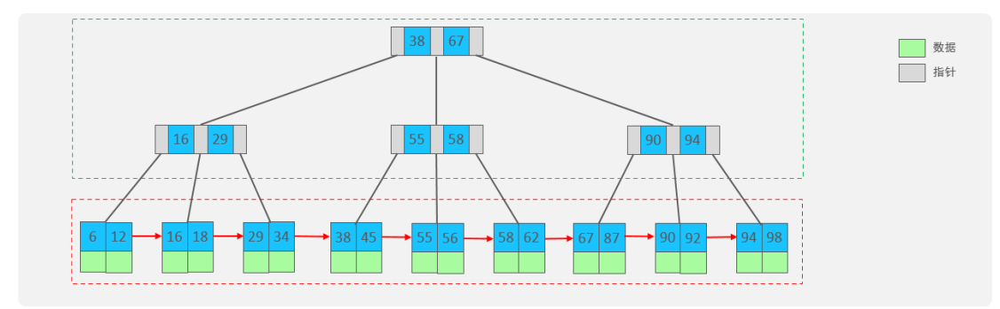
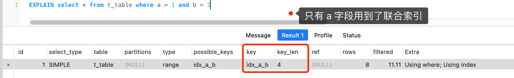
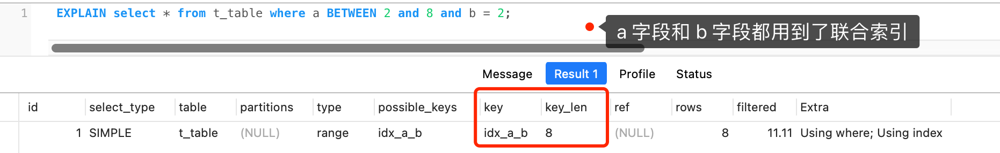
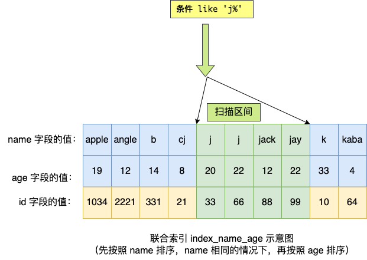
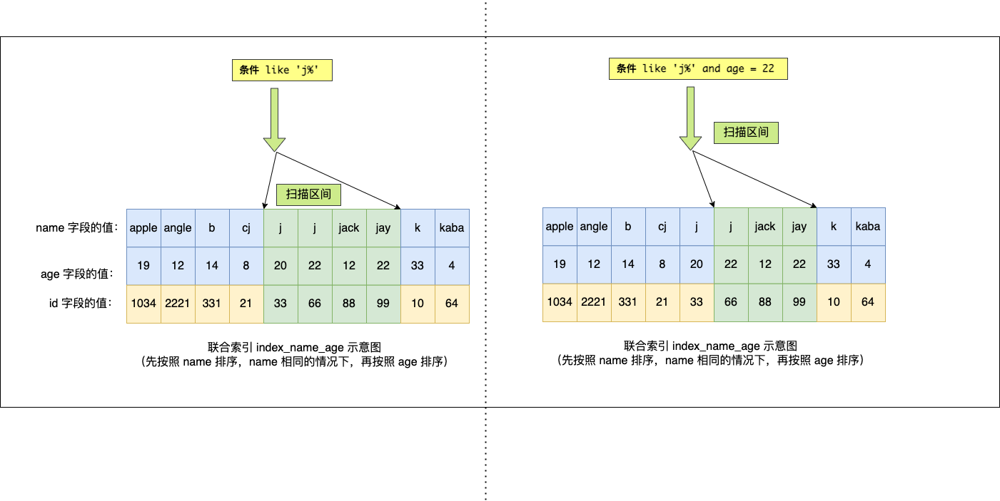
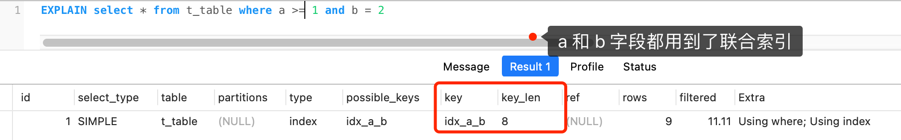
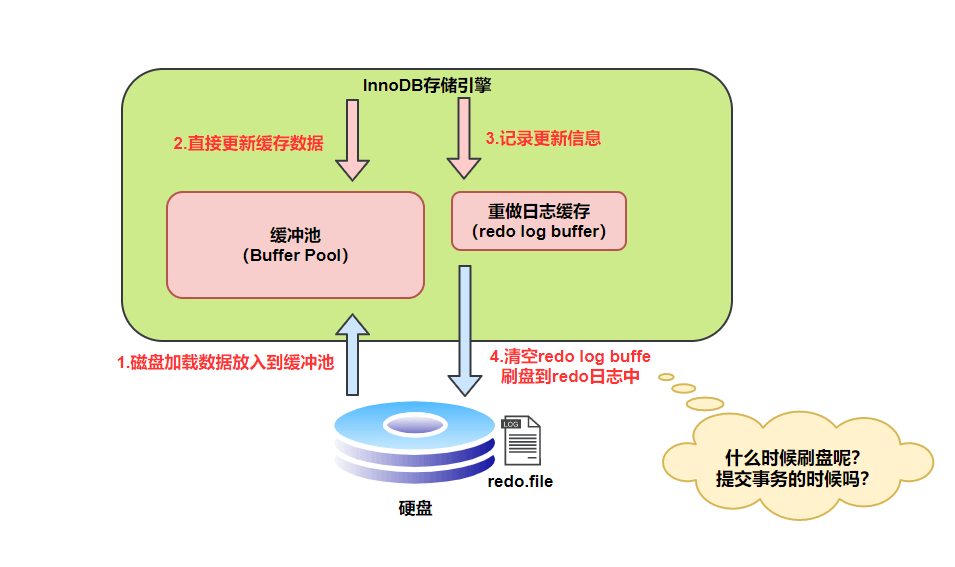

# MySQL总结

## 索引

### 索引介绍

索引是一种用于快速查询和检索数据的数据结构，其本质可以看成是一种排序好的数据结构。（索引是一种数据结构）

### 索引的优缺点

**优点：**

1. 索引可以大大加快检索速度
2. 唯一索引可以保证数据的唯一性

**缺点：**

1. 创建索引和维护索引很耗时间
2. 索引需要使用物理文件储存，也会耗费空间

### MySQL索引底层数据结构



### MySQL为什么使用B+树做索引

1. 相对于二叉树，层级更少，搜索效率高；
2. 对于B-tree，无论是叶子节点还是非叶子节点，都会保存数据，这样导致一页中存储的键值减少（每页的大小是固定的），指针跟着减少，要同样保存大量数据，只能增加树的高度，导致性能降低；
3.  相对Hash索引，B+tree支持范围匹配及排序操作；

### 索引的分类

#### 索引的分类

在MySQL数据库，将索引的具体类型主要分为以下几类：主键索引、唯一索引、常规索引、全文索引。  

#### 按照底层存储方式分类

从物理存储的角度来看，索引分为**聚簇索引**（主键索引）、**二级索引**（辅助索引）。

这两个区别在前面也提到了：

1. 主键索引的 B+Tree 的叶子节点存放的是实际数据，所有完整的用户记录都存放在主键索引的 B+Tree 的叶子节点里（一整行数据）；
2. 二级索引的 B+Tree 的叶子节点存放的是主键值，而不是实际数据。

所以，在查询时使用了二级索引，如果查询的数据能在二级索引里查询的到，那么就不需要回表，这个过程就是**覆盖索引**。如果查询的数据不在二级索引里，就会先检索二级索引，找到对应的叶子节点，获取到主键值后，然后再检索主键索引，就能查询到数据了，这个过程就是**回表**。

**聚集索引的选取规则**

1. 如果存在主键，主键索引就是聚集索引。
2. 如果不存在主键，将使用第一个唯一（UNIQUE）索引作为聚集索引。
3. 如果表没有主键，或没有合适的唯一索引，则InnoDB会自动生成一个rowid作为隐藏的聚集索引。

#### 按字段个数分类

**联合索引：**

通过将多个字段组合成一个索引，该索引就被称为联合索引。

比如，将商品表中的 product_no 和 name 字段组合成联合索引`(product_no, name)`，创建联合索引的方式如下：

```sql
CREATE INDEX index_product_no_name ON product(product_no, name);
```



可以看到联合索引的先根据product_no进行排序，如果相同会再根据name进行排序 叶子节点当中也会储存这两个字段的数据


### 索引的性能分析

开启mysql的**profile** 操作可以查看sql语句具体执行了多少秒，还有对应的部分执行的时间

```sql
-- 查看每一条SQL的耗时基本情况
show profiles;
-- 查看指定query_id的SQL语句各个阶段的耗时情况
show profile for query query_id;
-- 查看指定query_id的SQL语句CPU的使用情况
show profile cpu for query query_id;
```

**explain** 

EXPLAIN 或者 DESC命令获取 MySQL 如何执行 SELECT 语句的信息，包括在 SELECT 语句执行过程中表如何连接和连接的顺序  

Explain 执行计划中各个字段的含义:  

| id           | select查询的序列号，表示查询中执行select子句或者是操作表的顺序(id相同，执行顺序从上到下；id不同，值越大，越先执行)。 |
| ------------ | ------------------------------------------------------------ |
| select_type  | 表示 SELECT 的类型，常见的取值有 SIMPLE（简单表，即不使用表连接或者子查询）、PRIMARY（主查询，即外层的查询）、UNION（UNION 中的第二个或者后面的查询语句）、SUBQUERY（SELECT/WHERE之后包含了子查询）等 |
| type         | 表示连接类型，性能由好到差的连接类型为NULL、system、const、eq_ref、ref、range、 index、all 。 |
| possible_key | 显示可能应用在这张表上的索引，一个或多个。                   |
| key          | 实际使用的索引，如果为NULL，则没有使用索引。                 |
| key_len      | 表示索引中使用的字节数， 该值为索引字段最大可能长度，并非实际使用长度，在不损失精确性的前提下， 长度越短越好 。 |
| rows         | MySQL认为必须要执行查询的行数，在innodb引擎的表中，是一个估计值，可能并不总是准确的。 |
| filtered     | 表示返回结果的行数占需读取行数的百分比， filtered 的值越大越好。 |

### 最左前缀原则

最左前缀匹配原则指的是，在使用联合索引时，**MySQL** 会根据联合索引中的字段顺序，从左到右依次到查询条件中去匹配，如果查询条件中存在与联合索引中最左侧字段相匹配的字段，则就会使用该字段过滤一批数据，直至联合索引中全部字段匹配完成，或者在执行过程中遇到范围查询（如 **`>`**、**`<`**）才会停止匹配。对于 **`>=`**、**`<=`**、**`BETWEEN`**、**`like`** 前缀匹配的范围查询，并不会停止匹配。所以，**我们在使用联合索引时，可以将区分度高的字段放在最左边，这也可以过滤更多数据。**

**分析几个最左前缀的例子**：

> Q1: `select * from t_table where a > 1 and b = 2`，联合索引（a, b）哪一个字段用到了联合索引的 B+Tree？

由于联合索引（二级索引）是先按照 a 字段的值排序的，所以符合 a > 1 条件的二级索引记录肯定是相邻，于是在进行索引扫描的时候，可以定位到符合 a > 1 条件的第一条记录，然后沿着记录所在的链表向后扫描，直到某条记录不符合 a > 1 条件位置。所以 a 字段可以在联合索引的 B+Tree 中进行索引查询。

**但是在符合 a > 1 条件的二级索引记录的范围里，b 字段的值是无序的**。比如前面图的联合索引的 B+ Tree 里，下面这三条记录的 a 字段的值都符合 a > 1 查询条件，而 b 字段的值是无序的：

- a 字段值为 5 的记录，该记录的 b 字段值为 8；
- a 字段值为 6 的记录，该记录的 b 字段值为 10；
- a 字段值为 7 的记录，该记录的 b 字段值为 5；

因此，我们不能根据查询条件 b = 2 来进一步减少需要扫描的记录数量（b 字段无法利用联合索引进行索引查询的意思）。

所以在执行 Q1 这条查询语句的时候，对应的扫描区间是 (2, + ∞)，形成该扫描区间的边界条件是 a > 1，与 b = 2 无关。

因此，**Q1 这条查询语句只有 a 字段用到了联合索引进行索引查询，而 b 字段并没有使用到联合索引**。

我们也可以在执行计划中的 key_len 知道这一点，在使用联合索引进行查询的时候，通过 key_len 我们可以知道优化器具体使用了多少个字段的搜索条件来形成扫描区间的边界条件。

举例个例子 ，a 和 b 都是 int 类型且不为 NULL 的字段，那么 Q1 这条查询语句执行计划如下，可以看到 key_len 为 4 字节（如果字段允许为 NULL，就在字段类型占用的字节数上加 1，也就是 5 字节），说明只有 a 字段用到了联合索引进行索引查询，而且可以看到，即使 b 字段没用到联合索引，key 为 idx_a_b，说明 Q1 查询语句使用了 idx_a_b 联合索引。



通过 Q1 查询语句我们可以知道，a 字段使用了 > 进行范围查询，联合索引的最左匹配原则在遇到 a 字段的范围查询（ >）后就停止匹配了，因此 b 字段并没有使用到联合索引。

> Q2: `select * from t_table where a >= 1 and b = 2`，联合索引（a, b）哪一个字段用到了联合索引的 B+Tree？

Q2 和 Q1 的查询语句很像，唯一的区别就是 a 字段的查询条件「大于等于」。

由于联合索引（二级索引）是先按照 a 字段的值排序的，所以符合 >= 1 条件的二级索引记录肯定是相邻，于是在进行索引扫描的时候，可以定位到符合 >= 1 条件的第一条记录，然后沿着记录所在的链表向后扫描，直到某条记录不符合 a>= 1 条件位置。所以 a 字段可以在联合索引的 B+Tree 中进行索引查询。

虽然在符合 a>= 1 条件的二级索引记录的范围里，b 字段的值是「无序」的，**但是对于符合 a = 1 的二级索引记录的范围里，b 字段的值是「有序」的**（因为对于联合索引，是先按照 a 字段的值排序，然后在 a 字段的值相同的情况下，再按照 b 字段的值进行排序）。

于是，在确定需要扫描的二级索引的范围时，当二级索引记录的 a 字段值为 1 时，可以通过 b = 2 条件减少需要扫描的二级索引记录范围（b 字段可以利用联合索引进行索引查询的意思）。也就是说，从符合 a = 1 and b = 2 条件的第一条记录开始扫描，而不需要从第一个 a 字段值为 1 的记录开始扫描。

所以，**Q2 这条查询语句 a 和 b 字段都用到了联合索引进行索引查询**。

我们也可以在执行计划中的 key_len 知道这一点。执行计划如下，可以看到 key_len 为 8 字节，说明优化器使用了 2 个字段的查询条件来形成扫描区间的边界条件，也就是 a 和 b 字段都用到了联合索引进行索引查询。



通过 Q2 查询语句我们可以知道，虽然 a 字段使用了 >= 进行范围查询，但是联合索引的最左匹配原则并没有在遇到 a 字段的范围查询（ >=）后就停止匹配了，b 字段还是可以用到了联合索引的。

> Q3: `SELECT * FROM t_table WHERE a BETWEEN 2 AND 8 AND b = 2`，联合索引（a, b）哪一个字段用到了联合索引的 B+Tree？

Q3 查询条件中 `a BETWEEN 2 AND 8` 的意思是查询 a 字段的值在 2 和 8 之间的记录。不同的数据库对 BETWEEN ... AND 处理方式是有差异的。在 MySQL 中，BETWEEN 包含了 value1 和 value2 边界值，类似于 >= and =<。而有的数据库则不包含 value1 和 value2 边界值（类似于 > and <）。

这里我们只讨论 MySQL。由于 MySQL 的 BETWEEN 包含 value1 和 value2 边界值，所以类似于 Q2 查询语句，因此 **Q3 这条查询语句 a 和 b 字段都用到了联合索引进行索引查询**。

我们也可以在执行计划中的 key_len 知道这一点。执行计划如下，可以看到 key_len 为 8 字节，说明优化器使用了 2 个字段的查询条件来形成扫描区间的边界条件，也就是 a 和 b 字段都用到了联合索引进行索引查询。


通过 Q3 查询语句我们可以知道，虽然 a 字段使用了 BETWEEN 进行范围查询，但是联合索引的最左匹配原则并没有在遇到 a 字段的范围查询（ BETWEEN）后就停止匹配了，b 字段还是可以用到了联合索引的。

> Q4: `SELECT * FROM t_user WHERE name like 'j%' and age = 22`，联合索引（name, age）哪一个字段用到了联合索引的 B+Tree？

由于联合索引（二级索引）是先按照 name 字段的值排序的，所以前缀为 ‘j’ 的 name 字段的二级索引记录都是相邻的， 于是在进行索引扫描的时候，可以定位到符合前缀为 ‘j’ 的 name 字段的第一条记录，然后沿着记录所在的链表向后扫描，直到某条记录的 name 前缀不为 ‘j’ 为止。

所以 a 字段可以在联合索引的 B+Tree 中进行索引查询，形成的扫描区间是['j','k')。注意， j 是闭区间。如下图：



虽然在符合前缀为 ‘j’ 的 name 字段的二级索引记录的范围里，age 字段的值是「无序」的，**但是对于符合 name = j 的二级索引记录的范围里，age字段的值是「有序」的**（因为对于联合索引，是先按照 name 字段的值排序，然后在 name 字段的值相同的情况下，再按照 age 字段的值进行排序）。

于是，在确定需要扫描的二级索引的范围时，当二级索引记录的 name 字段值为 ‘j’ 时，可以通过 age = 22 条件减少需要扫描的二级索引记录范围（age 字段可以利用联合索引进行索引查询的意思）。也就是说，从符合 `name = 'j' and age = 22` 条件的第一条记录时开始扫描，而不需要从第一个 name 为 j 的记录开始扫描 。如下图的右边：



所以，**Q4 这条查询语句 a 和 b 字段都用到了联合索引进行索引查询**。

### 什么时候需要创建索引

#### 什么时候适用索引？

- 字段有唯一性限制的，比如商品编码；
- 经常用于 `WHERE` 查询条件的字段，这样能够提高整个表的查询速度，如果查询条件不是一个字段，可以建立联合索引。
- 经常用于 `GROUP BY` 和 `ORDER BY` 的字段，这样在查询的时候就不需要再去做一次排序了，因为我们都已经知道了建立索引之后在 B+Tree 中的记录都是排序好的。

#### 什么时候不需要索引

- `WHERE` 条件，`GROUP BY`，`ORDER BY` 里用不到的字段，索引的价值是快速定位，如果起不到定位的字段通常是不需要创建索引的，因为索引是会占用物理空间的。
- 字段中存在大量重复数据，不需要创建索引，比如性别字段，只有男女，如果数据库表中，男女的记录分布均匀，那么无论搜索哪个值都可能得到一半的数据。在这些情况下，还不如不要索引，因为 MySQL 还有一个查询优化器，查询优化器发现某个值出现在表的数据行中的百分比很高的时候，它一般会忽略索引，进行全表扫描。
- 表数据太少的时候，不需要创建索引；
- 经常更新的字段不用创建索引，比如不要对电商项目的用户余额建立索引，因为索引字段频繁修改，由于要维护 B+Tree的有序性，那么就需要频繁的重建索引，这个过程是会影响数据库性能的。

### 索引下推

**索引下推（Index Condition Pushdown）** 是 **MySQL 5.6** 版本中提供的一项索引优化功能，可以在非聚簇索引遍历过程中，对索引中包含的字段先做判断，过滤掉不符合条件的记录，减少回表次数。

ICP解释：https://www.cnblogs.com/three-fighter/p/15246577.html

### 索引失效的几种情况

- 当我们使用左或者左右模糊匹配的时候，也就是 `like %xx` 或者 `like %xx%`这两种方式都会造成索引失效；
- 当我们在查询条件中对索引列做了计算、函数、类型转换操作，这些情况下都会造成索引失效；
- 联合索引要能正确使用需要遵循最左匹配原则，也就是按照最左优先的方式进行索引的匹配，否则就会导致索引失效。
- 在 WHERE 子句中，如果在 OR 前的条件列是索引列，而在 OR 后的条件列不是索引列，那么索引会失效。
- 发生隐式类型转化 比如进行字符串匹配的时候没有加上引号


## MySQL 三大日志的详解（binlog redo log  undo log）

### 前言

MYSQL 的日志种类：错误日志、查询日志、慢查询日志、事务日志、二进制日志 其中最重要的是 二进制日志（redo log）和 事务日志（redo log）回滚日志（undo log）


### redo log

redo log 是mysql用来进行崩溃恢复的，是InnoDB引擎特有的

mysql 实例挂了或者 引擎会使用redo log来恢复数据 保证数据的持久性 和完整性



上述过程简述：

1. 当查询数据的时候，mysql将磁盘当中的一整页的数据取出放到缓冲池当中 后续查询页直接在缓冲词当中查询
2. 如果要更新数据 也直接在缓冲池当中更新
3. 将更新数据的记录信息写道redo log buffer当中
4. 将redo log buffer的数据写到redo log当中

理想情况，事务一提交就会进行刷盘操作，但实际上，刷盘的时机是根据策略来进行的。


**刷盘时机**

InnoDB存储引擎为 `redo log` 的刷盘策略提供了 `innodb_flush_log_at_trx_commit` 参数，它支持三种策略：

- **0** ：设置为 0 的时候，表示每次事务提交时不进行刷盘操作
- **1** ：设置为 1 的时候，表示每次事务提交时都将进行刷盘操作（默认值）
- **2** ：设置为 2 的时候，表示每次事务提交时都只把 redo log buffer 内容写入 page cache

