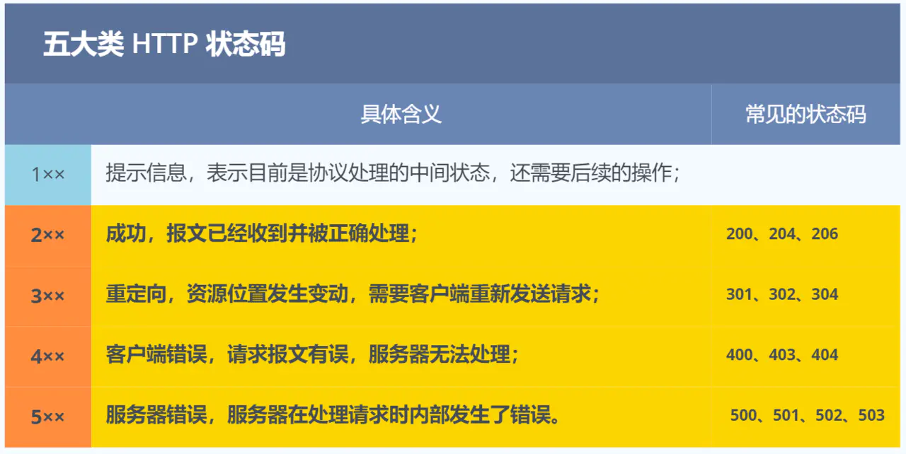

# 计算机网络

## 基础

### TCP/IP的网络模型

#### 应用层

1. TCP/IP分层模型当中的最上层的，是可以直接接触到的
2. 常见的应用层协议：HTTP FTP（文件传输） DNS（域名系统） SMTP（邮件系统）
3. 应用层的工作是在操作系统的用户态，而应用层以下是在操作系统的内核态当中工作的

#### 传输层

1. 应用层的数据会传给传输层
2. 传输层两个重要的协议：TCP UDP
3. TCP： 流量控制，超时重传，拥塞控制 ，可靠传输（面向有连接的传输）
4. UDP： 实时性好，传输效率更高（无需建立连接）
5. 当传输层的数据大于MSS（Max Segment Size， 会将数据包进行分段，如果其中一个段丢失或者损坏，则只需传输该段
6. 当传输层数据传递给应用层的时候，同一个设备当中有多个应用在接收或者传输数据，为了区分需要一个编号，这个编号 就是所谓的端口。web服务器的端口是80，SHH 一般是22 ，传输层的报文当中会携带需要发送到的端口号，以此来确定发给谁

#### 网络层

1. 负责将TCP的报文数据发送到接收方的设备当中，设备可能在同一个子网或者在不同子网下，不同子网之间用路由器进行转发数据 使用IP协议来转发数据 
2. IP协议会将TCP报文重新组装加上IP头，形成IP报文 如果IP报文的大小超过MTU（Max Transmission Unit） 会再次的进行分片
3. 网络层负责将一个设备传输到另一个设备，而不同设备之间需要有一个编号来确定——IP地址 
4. IP 地址 也分成两种意义： 网络地址 和 主机地址 
5. IP地址配合子网掩码可以计算出 对应的网络地址和主机地址 

#### 数据链路层

1. 每一个网络设备都有一个MAC（Media Access Control）地址
2. 根据目的设备的MAC地址来查找对应的网络设备
3. 在网络层当中我们获取到了目的设备的IP地址的时候，然后根据ARP协议解析得到对应的MAC地址 

#### 数据封装格式

## HTTP 协议

### 什么是Http协议？

HTTP 全称是超文本传输协议，Http是一个在计算机世界里专门在两点之间传输文字，图片，音频，视频等超文本数据的约定和规范

### Http 常见的状态码有哪些

`1xx` 类状态码属于**提示信息**，是协议处理中的一种中间状态，实际用到的比较少。

`2xx` 类状态码表示服务器**成功**处理了客户端的请求，也是我们最愿意看到的状态。

- 「**200 OK**」是最常见的成功状态码，表示一切正常。如果是非 `HEAD` 请求，服务器返回的响应头都会有 body 数据。
- 「**204 No Content**」也是常见的成功状态码，与 200 OK 基本相同，但响应头没有 body 数据。
- 「**206 Partial Content**」是应用于 HTTP 分块下载或断点续传，表示响应返回的 body 数据并不是资源的全部，而是其中的一部分，也是服务器处理成功的状态。

`3xx` 类状态码表示客户端请求的资源发生了变动，需要客户端用新的 URL 重新发送请求获取资源，也就是**重定向**。

- 「**301 Moved Permanently**」表示永久重定向，说明请求的资源已经不存在了，需改用新的 URL 再次访问。
- 「**302 Found**」表示临时重定向，说明请求的资源还在，但暂时需要用另一个 URL 来访问。

301 和 302 都会在响应头里使用字段 `Location`，指明后续要跳转的 URL，浏览器会自动重定向新的 URL。

- 「**304 Not Modified**」不具有跳转的含义，表示资源未修改，重定向已存在的缓冲文件，也称缓存重定向，也就是告诉客户端可以继续使用缓存资源，用于缓存控制。

`4xx` 类状态码表示客户端发送的**报文有误**，服务器无法处理，也就是错误码的含义。

- 「**400 Bad Request**」表示客户端请求的报文有错误，但只是个笼统的错误。
- 「**403 Forbidden**」表示服务器禁止访问资源，并不是客户端的请求出错。
- 「**404 Not Found**」表示请求的资源在服务器上不存在或未找到，所以无法提供给客户端。

`5xx` 类状态码表示客户端请求报文正确，但是**服务器处理时内部发生了错误**，属于服务器端的错误码。

- 「**500 Internal Server Error**」与 400 类型，是个笼统通用的错误码，服务器发生了什么错误，我们并不知道。
- 「**501 Not Implemented**」表示客户端请求的功能还不支持，类似“即将开业，敬请期待”的意思。
- 「**502 Bad Gateway**」通常是服务器作为网关或代理时返回的错误码，表示服务器自身工作正常，访问后端服务器发生了错误。
- 「**503 Service Unavailable**」表示服务器当前很忙，暂时无法响应客户端，类似“网络服务正忙，请稍后重试”的意思。

### Http常见的字段有哪些

1. host字段： 表示服务器的域名
2. content-length：表明本次回应的数据长度 比如 Content-Length:1000表明返回的数据的长度是1000个字节，所以后面的字节就属于下一个回应
3. Connection ：Connection 字段最长用于要求客户端使用HTTP长连接机制，以便其他请求复用。HTTP长连接的特点就是：只要任意一端没有明确提出断开连接，则保持TCP连接
4. Content-Type 字段用于服务器回应的时候，应该告诉客户端响应的数据是什么格式 比如Content-Type： text/html
5. Content-Encoding 字段表明一些数据的压缩方法 使用了什么压缩格式比如 Content-Encoding: gzip
6. Accept-Encoding: gzip , deflate 表示说明自己可以接收哪些压缩方法

### Get 和 Post 

#### get 和post 有什么区别？

1. get的语义是从服务器当中获取指定资源，get的请求参数一般是写在URL当中，浏览器对URL的长度是有限制的
2. post 的语义是根据请求符合（报文body）对指定资源做出处理 post请求携带的数据位置一般是写在报文的负载当中 可以是任意格式 ，并且不会限制body大小 当然post请求url当中也可以写上请求参数

#### get和post方法都是安全和幂等性的吗？

1. 所谓的安全：请求不会破坏服务器上的资源 所谓幂等：多次执行相同的操作结果都是相同的
2. get方法是安全且幂等的：因为它是一个只读操作，无论操作多少次，服务器上的数据都是安全的，且每次结果都是相同的（这是rfc规范当中）如果不按照语义规范定义的话，自然就不是安全和幂等的
3. post方法是不安全且不幂等的，因为post会像浏览器新增和提交数据，会修改服务器上的资源，所以是不安全的，且多次提交数据，就会创建多个资源，所以是不幂等的
4. 当然换种思路来看，get请求请求参数都在url之中，比较暴露 如果是关键信息会被泄露 而post的参数都是放在一个body当中的相对更加隐蔽
5. 当然只要抓个包post的请求数据就会被窃取，要想更安全应该使用HTTPS协议

#### get请求可以带参数吗？

1. rfc规范并没有规定get请求能不能带body，理论上任何请求都可以带body的，只是因为根据rfc规范定义的get请求时获取资源，所以根据这个语义不需要用到body

### HTTP缓存技术

#### Http缓存有哪些实现方式？

对于一些重复性的请求，可以把对应返回的数据都缓存在本地，下次直接读取本地的数据。HTTP缓存的两种方式：强制缓存和协商缓存

#### 什么是强制缓存？

强缓存指的是只要浏览器判断缓存没有过期，则直接使用浏览器的本地缓存，决定是否使用缓存的主动性在于浏览器这边。

#### 什么是协商缓存？

## Http 和Https

1. HTTP是超文本传输协议，信息是明文传输的，存在安全风险 HTTPS的存在就是解决HTTP的不安全的缺陷
2. HTTP的连接比较简单，TCP三次握手之后便可以进行HTTP的报文传输。但是HTTPS在TCP三次握手之后，还需要进行SSL/TLS的握手才可以进行加密报文传输
3. 默认的端口不一样，HTTP的默认端口是80 ，HTTPS默认的端口是443
4. HTTPS协议需要想CA(整数权威机构)申请数字整数，来保证服务器的身份是可信的

### HTTPS 解决了 HTTP 的哪些问题？

HTTP 由于是明文传输，所以安全上存在以下三个风险：

- **窃听风险**，比如通信链路上可以获取通信内容，用户号容易没。
- **篡改风险**，比如强制植入垃圾广告，视觉污染，用户眼容易瞎。
- **冒充风险**，比如冒充淘宝网站，用户钱容易没。

HTTPS解决上述的三个风险的方法：

1. **混合加密**的方式实现信息的机密性，解决了窃听风险
2. **摘要算法**的方式来实现**完整性**，它能够为数据生成独一无二的「指纹」，指纹用于校验数据的完整性，解决了篡改的风险。
3. 将服务器公钥放入到**数字证书**中，解决了冒充的风险。

### 1.混合加密

HTTPS通过混合加密的方式可以保证信息的**机密性**，解决了被窃听的风险

HTTPS使用了对称加密和非对称加密两种加密方式的结合，称之为混合加密。

具体地说，HTTPS的加密过程如下：

1. 客户端向服务器请求建立连接，并发送自己支持的加密算法列表。
2. 服务器选择一种加密算法，并向客户端发送自己的公钥和数字证书。
3. 客户端验证证书的合法性，并使用服务器公钥加密一个随机的对称密钥，并将其发送给服务器。
4. 服务器使用自己的私钥解密客户端发送的对称密钥。
5. 双方使用对称密钥进行加密和解密通信过程中的数据。

在这个过程中，对称加密算法用于加密通信过程中的数据，而非对称加密算法用于加密对称密钥的传输过程。对称加密算法具有加密速度快的优点，但对称密钥的传输却需要保证安全性，因为如果对称密钥被窃取，通信过程中的数据就会被解密。而非对称加密算法具有安全性好的优点，但加密速度相对较慢，因此不能直接用于加密通信过程中的大量数据。

因此，HTTPS使用对称加密和非对称加密相结合的方式，既保证了通信过程中数据的安全性，又提高了加密效率。

### 2.摘要算法和数字签名

为了保证传输的内容不被篡改，这个时候需要对内容计算出一个类似指纹的东西，同时将这个指纹发送给客户端，客户端根据传输的内容也会生成一个指纹，比对服务端发送的和客户端生成的这一指纹，如果相同则说明未被篡改，否则则被篡改。

计算机当中使用的是摘要算法，通过摘要算法生成上述的指纹（计算哈希值）

但是这只能保证内容不会被篡改，但是不能保证内容+hash值不会被中间人替换，因为这里缺少对客户端收到的消息是否来源于服务端的证明。

所以通过私钥加密，然后公钥解密的方式来确认消息的身份，也就是常说的**数字签名算法**。就是用的是这种方式，不过私钥加密内容不是内容本身，而是**对内容的哈希值加密**。

### 数字证书

通过前面的了解可以知道：

1. 可以通过哈希算法来保证消息的完整性
2. 可以通过数字签名来保证消息来源的可靠性

但是这些还是不够的，还缺少身份验证的环节，如果服务端的公钥被伪造了，这个时候客户端用你伪造的公钥去解密你的私钥加密的信息，自然能够通过，这样就有问题了

这个时候就需要一个数字证书认证机构（CA）将你得个人信息+公钥+数字签名打包成一个数字证书。

流程如下：

1. 服务器将自己的公钥注册到CA
2. CA用自己的私钥将服务器的公钥进行数字签名并颁发数字签名
3. 将数字签名和公钥构成的数字证书发送给客户端，客户端通过CA公钥确认数字证书的真实性
4. 使用数字证书当中的公钥对传输的报文加密后再发送给服务端
5. 服务端用自己的私钥进行解密得到发送的报文
