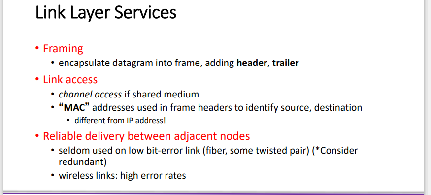
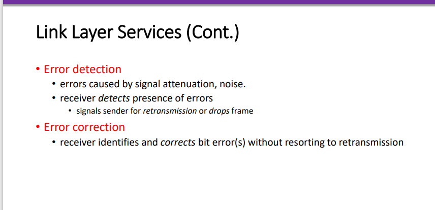
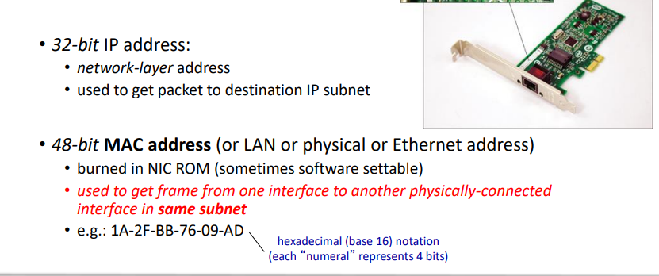
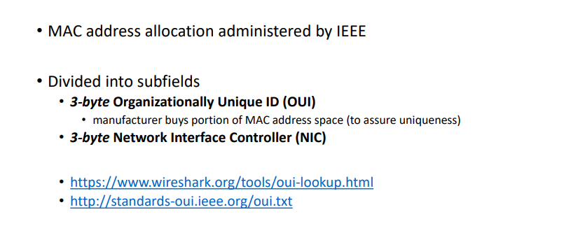
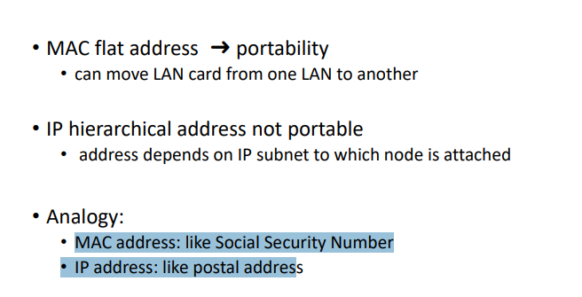

# Computer-Network

## Link Layer

### Introduction

每一个host 和router都是一个nodes

链路层的数据单位是frame ,encapsulates datagram，其主要是在相邻的两个节点当中传输frame 也就是encapsulates datagram（封装数据报）

分成两个子层

**LLC**：逻辑链路控制（Logical Link Control，LLC）是计算机网络中数据链路层的子层之一，它负责提供可靠的数据传输服务和错误检测，以确保在物理媒介上传输的数据的准确性和完整性。LLC层在不同的数据链路层协议中使用，例如以太网和令牌环等。

LLC层的主要功能包括流量控制、差错检测和纠正、帧同步、数据重传、帧序号管理等。它通过使用适当的控制机制来管理数据的传输和接收，同时确保传输的数据是准确的，并且在必要时可以进行纠正。由于LLC层提供了可靠的数据传输服务，因此它是网络协议栈中非常重要的一层，对于确保网络数据的准确性和完整性起着至关重要的作用。

**MAC：**媒体访问控制（Media Access Control，MAC）是计算机网络中数据链路层的一个子层，它负责控制计算机在共享物理媒介（例如以太网）上的访问。MAC层通常与物理层紧密集成，用于管理数据在物理媒介上传输的方式和时间。

在MAC层中，每个网络接口都有一个唯一的MAC地址，它是由网络设备制造商分配的。MAC地址是一个48位的二进制数字，通常表示为十六进制数，用于标识网络中不同设备之间的唯一身份。

MAC层的主要功能包括媒体访问控制、帧同步、差错检测和纠正等。它使用各种算法和协议来控制设备之间的访问和通信，以避免冲突和碰撞，并最大化网络的带宽利用率。

总之，MAC层在计算机网络中扮演着至关重要的角色，它负责管理数据在物理媒介上的传输方式和时间，以确保网络数据的高效和可靠传输。

### Link Layer Services

1. 封装成帧和解封装，就是添加对应的header和tailer
2. 链路访问，每一个网络设备都有一个MAC地址，这个MAC地址同样也会记录在帧的头部当中，去辨别发送方(source)和接收方(destination)
3. 相邻节点之间的可靠传输，很少使用低位的
4. 差错检测和纠正，常见的差错检测比如CRC 和Hamming code

### Example of Data Link Protocols

#### LAN （局域网）

常见包括 Ethernet，Wireless Lan （以太网，无线局域网）

**LAN addresses**

局域网当中的每一个适配器都有一个独一无二的MAC地址，这个地址标注着对应的目的地址

### MAC Address vs. IP Address

