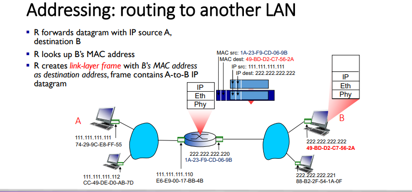

# Computer-Network

## Link Layer

### Introduction

每一个host 和router都是一个nodes

链路层的数据单位是frame ,其主要是在相邻的两个节点当中传输frame 

**分成两个子层**

**LLC**：逻辑链路控制（Logical Link Control，LLC）是计算机网络中数据链路层的子层之一，它负责提供可靠的数据传输服务和错误检测，以确保在物理媒介上传输的数据的准确性和完整性。LLC层在不同的数据链路层协议中使用，例如以太网和令牌环等。

LLC层的主要功能包括流量控制、差错检测和纠正、帧同步、数据重传、帧序号管理等。它通过使用适当的控制机制来管理数据的传输和接收，同时确保传输的数据是准确的，并且在必要时可以进行纠正。由于LLC层提供了可靠的数据传输服务，因此它是网络协议栈中非常重要的一层，对于确保网络数据的准确性和完整性起着至关重要的作用。

**MAC：**媒体访问控制（Media Access Control，MAC）是计算机网络中数据链路层的一个子层，它负责控制计算机在共享物理媒介（例如以太网）上的访问。MAC层通常与物理层紧密集成，用于管理数据在物理媒介上传输的方式和时间。

在MAC层中，每个网络接口都有一个唯一的MAC地址，它是由网络设备制造商分配的。MAC地址是一个48位的二进制数字，通常表示为十六进制数，用于标识网络中不同设备之间的唯一身份。

MAC层的主要功能包括媒体访问控制、帧同步、差错检测和纠正等。它使用各种算法和协议来控制设备之间的访问和通信，以避免冲突和碰撞，并最大化网络的带宽利用率。

总之，MAC层在计算机网络中扮演着至关重要的角色，它负责管理数据在物理媒介上的传输方式和时间，以确保网络数据的高效和可靠传输。

### Link Layer Services

1. 封装成帧和解封装，就是添加对应的header和tailer
2. 链路访问，每一个网络设备都有一个MAC地址，这个MAC地址同样也会记录在帧的头部当中，去辨别发送方(source)和接收方(destination)
3. 相邻节点之间的可靠传输，很少使用低位的
4. 差错检测和纠正，常见的差错检测比如CRC 和Hamming code

### LAN （局域网）

常见包括 Ethernet，Wireless Lan （以太网，无线局域网）

**LAN addresses**

局域网当中的每一个适配器都有一个独一无二的MAC地址，这个地址标注着对应的目的地址

#### MAC Address vs. IP Address

#### MAC Address Format

MAC地址是48bit的地址

下图是它的基本结构

前24位是厂商识别号，后24位厂商可以自由分配

当知道IP地址的情况下，**ARP协议**可以通过IP地址找到对应的MAC地址

其工作原理如下：

1. 发送ARP请求： 当源计算机需要发送数据到目标计算机时，它首先检查本地ARP高速缓存（ARP Cache），看是否已经知道目标计算机的MAC地址。如果没有，它会向本地局域网内发送一个ARP请求广播帧，其中包含源计算机的MAC地址和IP地址以及目标计算机的IP地址。
2. 接收ARP请求的计算机响应： 在同一局域网内的所有计算机都会收到这个ARP请求广播帧，但只有目标计算机会响应。目标计算机会将自己的MAC地址作为应答包的目的MAC地址，并将该地址发送给源计算机的MAC地址。
3. 源计算机更新ARP缓存： 当源计算机收到目标计算机的ARP应答包时，它将该MAC地址与目标IP地址关联，并将其存储在本地ARP高速缓存中。下次发送数据时，源计算机就可以直接使用该MAC地址，而不需要再次发送ARP请求。

ARP请求是广播请求，而回复是单播回复

#### Addressing: routing to another LAN

探究不同子网之间怎么寻址

1. 首先，数据包当中有src Ip和dest IP，这个时候先判断目的IP是否和原IP地址在同一个子网内（通过子网掩码）如果不在一个子网内，则这个时候将ARP包发送给对应的路由器端口（网关）得到路由器的MAC地址，

   更新数据包当中的MAC DEST然后发送给路由器

   

2. 然后路由器查询**路由表**找到下一跳路由器的IP地址之后，同样也是使用ARP协议重新寻找下一个MAC地址 在这个例子中，只用查一次路由表就找到目的主机所在的子网了（如下图）

   

3. 根据IP找到这个主机地址之后，继续使用ARP协议像目的主机当中获得目的主机的MAC地址重新封装数据帧（如下图）

   

4. 最后路由器将数据包发送给目的主机

   

#### Ethernet: Physical Topology

总线形和星形

#### Ethernet Frame Structure

| 目标地址 (6 byte) | 源地址 (6 byte) | 类型/长度字段 (2 byte) | 数据字段 (46-1500 byte) | 帧校验序列 (4 byte) |

各个字段的含义如下：

- 目标地址（Destination Address）：6个字节，用于表示帧的接收方的MAC地址；
- 源地址（Source Address）：6个字节，用于表示帧的发送方的MAC地址；
- 类型/长度字段（Type/Length Field）：2个字节，用于表示数据字段中的数据类型或长度信息。如果这个字段的值大于1536，则表示数据类型；否则，表示数据长度；
- 数据字段（Data Field）：46-1500个字节，用于存放数据；
- 帧校验序列（Frame Check Sequence）：4个字节，用于校验帧的完整性和正确性。

以上是标准以太网帧的结构，实际上在某些情况下，以太网帧的结构可能会略有不同。例如，当以太网帧中的数据字段长度小于46个字节时，需要添加填充字节来使数据字段达到46个字节。此外，在某些以太网标准中，还可能会添加一些额外的字段或选项。

#### Ethernet Switch

交换机是计算机网络中的一种网络设备，它主要用于在局域网内转发和过滤数据包，以实现网络中计算机之间的通信。

交换机可以通过**学习（learning**）MAC地址来建立一个MAC地址表，该表记录了每个设备的MAC地址和对应的端口号。当交换机接收到一个数据包时，它会查找该数据包中的目标MAC地址，并在MAC地址表中查找该地址对应的端口号，然后将数据包转发到该端口上。如果目标MAC地址不在MAC地址表中，则交换机会将数据包广播到所有端口，以便于找到该设备的位置。（如下图）

交换机的作用包括以下几个方面：

- 实现数据的快速转发和过滤，提高网络的传输效率；
- 建立MAC地址表，实现局域网内设备的地址学习和地址转发；
- 支持虚拟局域网（VLAN）功能，实现网络的分割和隔离；
- 支持链路聚合（Link Aggregation）功能，实现带宽的增加和冗余备份；
- 支持Quality of Service（QoS）功能，实现对不同类型数据流的优先级控制和带宽限制。

#### VLAN

未完待续.........

### Multiple access protocols

### 