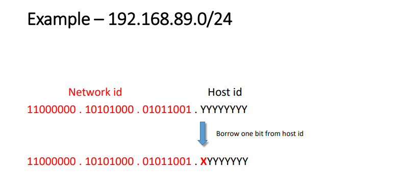

# Computer-Network

## Link Layer

### Introduction

每一个host 和router都是一个nodes

链路层的数据单位是frame ,其主要是在相邻的两个节点当中传输frame 

**分成两个子层**

**LLC**：逻辑链路控制（Logical Link Control，LLC）是计算机网络中数据链路层的子层之一，它负责提供可靠的数据传输服务和错误检测，以确保在物理媒介上传输的数据的准确性和完整性。LLC层在不同的数据链路层协议中使用，例如以太网和令牌环等。

LLC层的主要功能包括流量控制、差错检测和纠正、帧同步、数据重传、帧序号管理等。它通过使用适当的控制机制来管理数据的传输和接收，同时确保传输的数据是准确的，并且在必要时可以进行纠正。由于LLC层提供了可靠的数据传输服务，因此它是网络协议栈中非常重要的一层，对于确保网络数据的准确性和完整性起着至关重要的作用。

**MAC：**媒体访问控制（Media Access Control，MAC）是计算机网络中数据链路层的一个子层，它负责控制计算机在共享物理媒介（例如以太网）上的访问。MAC层通常与物理层紧密集成，用于管理数据在物理媒介上传输的方式和时间。

在MAC层中，每个网络接口都有一个唯一的MAC地址，它是由网络设备制造商分配的。MAC地址是一个48位的二进制数字，通常表示为十六进制数，用于标识网络中不同设备之间的唯一身份。

MAC层的主要功能包括媒体访问控制、帧同步、差错检测和纠正等。它使用各种算法和协议来控制设备之间的访问和通信，以避免冲突和碰撞，并最大化网络的带宽利用率。

总之，MAC层在计算机网络中扮演着至关重要的角色，它负责管理数据在物理媒介上的传输方式和时间，以确保网络数据的高效和可靠传输。

### Link Layer Services

1. 封装成帧和解封装，就是添加对应的header和tailer
2. 链路访问，每一个网络设备都有一个MAC地址，这个MAC地址同样也会记录在帧的头部当中，去辨别发送方(source)和接收方(destination)
3. 相邻节点之间的可靠传输，很少使用低位的
4. 差错检测和纠正，常见的差错检测比如CRC 和Hamming code

### LAN （局域网）

常见包括 Ethernet，Wireless Lan （以太网，无线局域网）

**LAN addresses**

局域网当中的每一个适配器都有一个独一无二的MAC地址，这个地址标注着对应的目的地址

#### MAC Address vs. IP Address

#### MAC Address Format

MAC地址是48bit的地址

下图是它的基本结构

前24位是厂商识别号，后24位厂商可以自由分配

当知道IP地址的情况下，**ARP协议**可以通过IP地址找到对应的MAC地址

其工作原理如下：

1. 发送ARP请求： 当源计算机需要发送数据到目标计算机时，它首先检查本地ARP高速缓存（ARP Cache），看是否已经知道目标计算机的MAC地址。如果没有，它会向本地局域网内发送一个ARP请求广播帧，其中包含源计算机的MAC地址和IP地址以及目标计算机的IP地址。
2. 接收ARP请求的计算机响应： 在同一局域网内的所有计算机都会收到这个ARP请求广播帧，但只有目标计算机会响应。目标计算机会将自己的MAC地址作为应答包的目的MAC地址，并将该地址发送给源计算机的MAC地址。
3. 源计算机更新ARP缓存： 当源计算机收到目标计算机的ARP应答包时，它将该MAC地址与目标IP地址关联，并将其存储在本地ARP高速缓存中。下次发送数据时，源计算机就可以直接使用该MAC地址，而不需要再次发送ARP请求。

ARP请求是广播请求，而回复是单播回复

#### Addressing: routing to another LAN

探究不同子网之间怎么寻址

1. 首先，数据包当中有src Ip和dest IP，这个时候先判断目的IP是否和原IP地址在同一个子网内（通过子网掩码）如果不在一个子网内，则这个时候将ARP包发送给对应的路由器端口（网关）得到路由器的MAC地址，

   更新数据包当中的MAC DEST然后发送给路由器

   

2. 然后路由器查询**路由表**找到下一跳路由器的IP地址之后，同样也是使用ARP协议重新寻找下一个MAC地址 在这个例子中，只用查一次路由表就找到目的主机所在的子网了（如下图）

   

3. 根据IP找到这个主机地址之后，继续使用ARP协议像目的主机当中获得目的主机的MAC地址重新封装数据帧（如下图）

   

4. 最后路由器将数据包发送给目的主机

   

#### Ethernet: Physical Topology

总线形和星形

#### Ethernet Frame Structure

| 目标地址 (6 byte) | 源地址 (6 byte) | 类型/长度字段 (2 byte) | 数据字段 (46-1500 byte) | 帧校验序列 (4 byte) |

各个字段的含义如下：

- 目标地址（Destination Address）：6个字节，用于表示帧的接收方的MAC地址；
- 源地址（Source Address）：6个字节，用于表示帧的发送方的MAC地址；
- 类型/长度字段（Type/Length Field）：2个字节，用于表示数据字段中的数据类型或长度信息。如果这个字段的值大于1536，则表示数据类型；否则，表示数据长度；
- 数据字段（Data Field）：46-1500个字节，用于存放数据；
- 帧校验序列（Frame Check Sequence）：4个字节，用于校验帧的完整性和正确性。

以上是标准以太网帧的结构，实际上在某些情况下，以太网帧的结构可能会略有不同。例如，当以太网帧中的数据字段长度小于46个字节时，需要添加填充字节来使数据字段达到46个字节。此外，在某些以太网标准中，还可能会添加一些额外的字段或选项。

#### Ethernet Switch

交换机是计算机网络中的一种网络设备，它主要用于在局域网内转发和过滤数据包，以实现网络中计算机之间的通信。

交换机可以通过**学习（learning**）MAC地址来建立一个MAC地址表，该表记录了每个设备的MAC地址和对应的端口号。当交换机接收到一个数据包时，它会查找该数据包中的目标MAC地址，并在MAC地址表中查找该地址对应的端口号，然后将数据包转发到该端口上。如果目标MAC地址不在MAC地址表中，则交换机会将数据包广播到所有端口，以便于找到该设备的位置。（如下图）

交换机的作用包括以下几个方面：

- 实现数据的快速转发和过滤，提高网络的传输效率；
- 建立MAC地址表，实现局域网内设备的地址学习和地址转发；
- 支持虚拟局域网（VLAN）功能，实现网络的分割和隔离；
- 支持链路聚合（Link Aggregation）功能，实现带宽的增加和冗余备份；
- 支持Quality of Service（QoS）功能，实现对不同类型数据流的优先级控制和带宽限制。

#### VLAN

未完待续.........

### Multiple access protocols

 

## Netword layer

### IP Addr 概述

1. 在网络层当中的主要协议就是IP协议

2. ip地址会分配给网络当中的每一个节点，也是为了区别不同网络的节点

3. 有两种形式的IP地址

   - IPV4 ：32 bit
   - IPV6： 64 bit

4. 32位的ip地址被分成四组每组八位，如果细化可以将IP地址分成两个part 一个network id 一个是host id

   

### Classes of IP addr

1. 总共有五种IP地址

   

2. Class A

   

   主要看第一组的range，range在1-126

3. Class B

   

   range在128-191之间

4. Class C

   

   range在192-223之间的

5. Class D and Class E

   

6. Special Addresses

   

7. Public and Private IP Addresses

   

### Subnet Mask

子网掩码可以确定Network id和host id 的分布，哪些位是用于networdid 哪些是用于host id ，其中是1 的位代表network id 是 0的位代表 host id

ip和子网掩码进行按位与的操作，则可以得到对应的network id，

**Default Subnet Mask**

**CIDR (Classless Interdomain Routing)**

一种表示 方法，用/24表示这个子网的子网掩码是24个1 和8 个0 也就是255：255：255：0

### How to Create Subnets（key）

子网划分的原理

核心的思路就是，从host位当中借位成network id当中的位，具体借几位和你要划分几个子网相关，比如划分两个子网就是1位，4个子网就是两位

通过上述的例子，几乎已经明白是怎么划分子网的了，所以这个时候看一下不同class的ip的子网掩码表：

### Internet Protocol (IP)

1.  IP 在网络层进行操作 
2.  规定了数据应该如何传递和传递到哪里 
3. IP 使得 TCP/IP 能够在多个局域网段和多种类型的网络之间进行互联，通过路由器进行传输 
4. IP 是一种不可靠的、无连接的协议 这意味着 IP 不能保证数据的传递，并且在传输数据之前不建立连接 
5.  IP 依赖于 TCP 来确保数据包被传递到正确的地址。

### IPv4 Packet Header Format

IPv4 数据包中的字段如下所述：

1. 版本（4 位）：
   - 表示所使用的 IP 协议的版本号。
   - 值为 "4" 表示 IPv4。
2. 头部长度（4 位）：
   - 指示 IP 头部的长度，以 32 位字长为单位。
   - 如果没有选项存在，则值为 "5"。
   - 实际的长度通过将该值乘以 4 来计算（例如，值为 5 对应头部长度为 20 字节）。
3. 服务类型（8 位）：
   - 也称为服务类型（Type of Service，ToS）字段。
   - 指定数据包的服务质量和优先级。
   - 在实际应用中很少使用，通常被忽略或设置为默认值。
4. 总长度（16 位）：
   - 表示 IP 数据包的总字节数，包括头部和有效载荷（数据）。
   - 最大值为 65,535 字节（包括没有选项存在时的 20 字节头部）。
5. 标识（Identification，16 位）：
   - 用于将分片收集到一起以进行重组的数据包分配的标识符。
   - 在 IP 分片和重组过程中，所有属于同一个原始数据包的片段都会共享相同的标识符。
6. 标志（Flags，3 位）：
   - 指示数据包是否被分片的标志位。
   - 第一位（最左边的位）为保留位，目前未被使用，预留给未来的扩展。
   - 第二位表示是否禁止对该数据包进行分片。当该位被设置为 1 时，表明该数据包不允许进一步分片。
   - 第三位用于指示是否有更多的分片。当该位被设置为 1 时，表示还有更多的分片属于同一个原始数据包。
7. 分片偏移（Fragment Offset，13 位）：
   - 指定该分片在原始数据包中的位置。
   - 分片偏移的值是以 8 为倍数的偏移量，用于计算分片在原始数据包中的准确位置。
8. 生存时间（Time to Live，TTL）（8 位）：
   - 表示数据包在网络中保留的最长时间，超过该时间后数据包将被丢弃。
   - 也可以理解为数据包在网络中经过的最大路由器跳数。
   - 通常被设置为 32 或 64。
   - 每经过一个路由器，TTL 值会减少 1。
   - 当 TTL 值减至 0 时，数据包将被丢弃并报告错误。
9. 协议（Protocol）（8 位）：
   - 用于标识将接收该数据包的协议类型。
   - 例如，TCP 的协议号是 6，UDP 的协议号是 17。
   - 通过该字段，接收端可以知道如何正确处理接收到的数据包，选择合适的协议进行处理。
10. 头部校验和（Header Checksum，16 位）：

    - 允许接收主机计算 IP 头部在传输过程中是否被损坏。

    - 通过对头部字段进行校验和计算，接收端可以检查头部是否完整和未		被篡改。

11. 源 IP 地址（Source IP Address，32 位）：

    - 表示原始发送方（源主机）的 IP 地址。
    - 头部中不包含中间路由器的地址，只记录原始发送方的地址。

12. 目标 IP 地址（Destination IP Address，32 位）：

    - 表示最终目标主机的 IP 地址。
    - 头部中不包含中间路由器的地址，只记录最终目标主机的地址
13. 选项（Options）：

	- 选项字段用于提供可选的路由和时间相关信息。
	- 这些选项通常是可选的，并且在大多数情况下被省略。
	- 选项字段允许在 IP 头部中添加附加的控制信息，例如记录数据包的路由路径、请求特定的服务质量或指定数据包的时间敏感性等。
	- 选项字段的具体格式和内容取决于所使用的选项类型，不同类型的选项可以提供不同的功能。

14. 填充（Padding）：

	- 如果选项字段的长度不是 32 位的整数倍，就会在选项字段的末尾添加零位，使得整个头部的长度能够成为 32 位的倍数。
	- 这种填充操作确保 IP 头部的长度满足对齐要求，便于在网络设备上的处理和解析。

### IP数据分片

1. 数据字段的传输是有大小限制的，称之为MTU
2. 所以一个 比较大的数据包需要对其进行分片来传输

分片的基本流程和例子：

一个数据包的总长度为3820字节，其数据部分为3800字节（使用固定
首部），需要分为长度不超过1420字节的数据包片。因固定首部长度为20字
节，所以每个数据包片的数据部分长度不能超过1400字节。于是分为3个数
据包片，其数据部分的长度分别为1400、1400和1000字节。原始数据包首
部被复制为各数据包片的首部，但必须修改有关字段的值。图5-6所示为分片
后得出的结果（注意片偏移的数值）。

offset的计算是body的长度来计算的，比如第一个就是0 第二个就是0+前一个的body/8这样

每个分片的identification都是一样的

### Internet Control Message Protocol (ICMP)

ICMP是TCP/IP协议栈中网络层的一个协议，ICMP即Internet Control
Message Protocol（互联网控制报文协议）的缩写，用于在IP主机、路由器
之间传递控制消息。控制消息是指网络通不通、主机是否可达、路由是否可
用等网络本身的消息。
ICMP报文是在IP数据报内部被传输的，它封装在IP数据报内。ICMP报
文通常被IP层或更高层协议（TCP或UDP）使用。一些ICMP报文把差错报文
返回给用户进程。

#### ICMP的请求和响应信息

下图是ICMP的请求和响应报文类型和代码及其对应的描述

**ICMP的报文是封装在IP报文中的**

