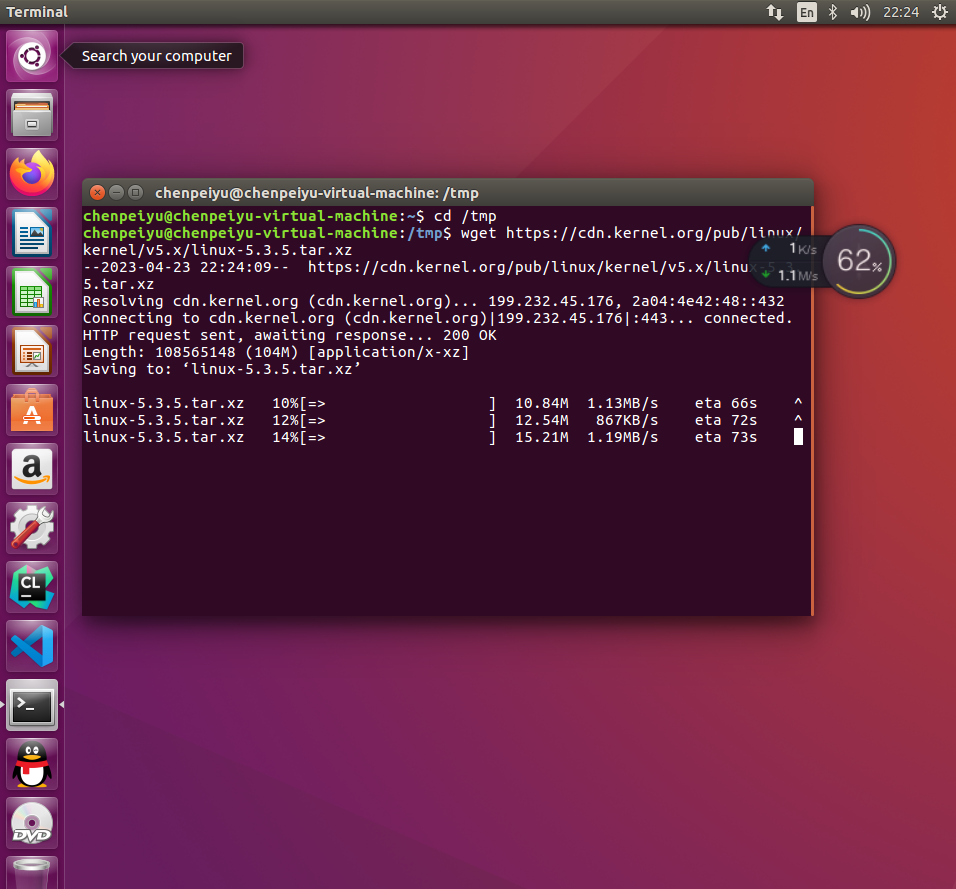

# OS Assignmet1 的简要记录

1. 切换到tmp目录下 用wget下载对应的内核压缩包

   

2. 下载后解压对应的目录

   

   验证Linux内核压缩包的完整性

   

   可以发现报了一个public key is not found的错误

   从上面的输出当中获取到RSA 的公钥6092693E

   执行下列的命令

   ```shell
   $ gpg --recv-keys 6092693E
   ```

   

   直接运行报了一个错误，bad uri 

   

   询问了chatgpt之后发现是这个问题（服务器有问题）

   重新运行之后

   

    成功 并且得到样例输出

   

   查看了一下对应的key 发现没问题

   然后开始验证签名

   

   ```shell
   gpg: assuming signed data in `linux-5.3.5.tar'
   gpg: Signature made 2019年10月08日 星期二 01时02分42秒 CST using RSA key ID 6092693E
   gpg: Good signature from "Greg Kroah-Hartman <gregkh@linuxfoundation.org>"
   gpg:                 aka "Greg Kroah-Hartman <gregkh@kernel.org>"
   gpg:                 aka "Greg Kroah-Hartman (Linux kernel stable release signing key) <greg@kroah.com>"
   gpg: WARNING: This key is not certified with a trusted signature!
   gpg:          There is no indication that the signature belongs to the owner.
   Primary key fingerprint: 647F 2865 4894 E3BD 4571  99BE 38DB BDC8 6092 693E
   
   ```

   

   

   运动tar命令解压内核压缩包

   

   

3. 配置内核特诊和对应的模块

   

   将现有内核的配置文件复制到这个包的下面并且重新命名为.config 

4. 安装需要的编译器和其他工具

   

   查看一下是否安装成功

   

   

   安装flex和bison

   

   执行这个命令 会打开一个界面，但是不用修改直接exit 即可

   ```shell
   $ make menuconfig
   ```

   

5. 配置内核

   编译模块 （我得虚拟机是4核心的）

   

   6. 安装模块
   
      
   
   7. 安装内核
   
      
   
   8. 
   
   