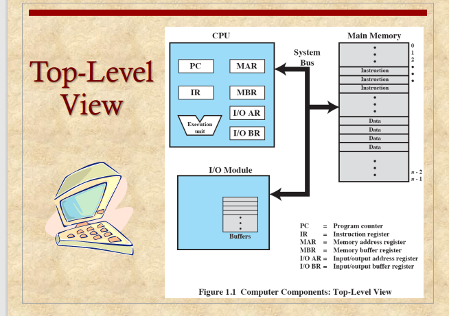
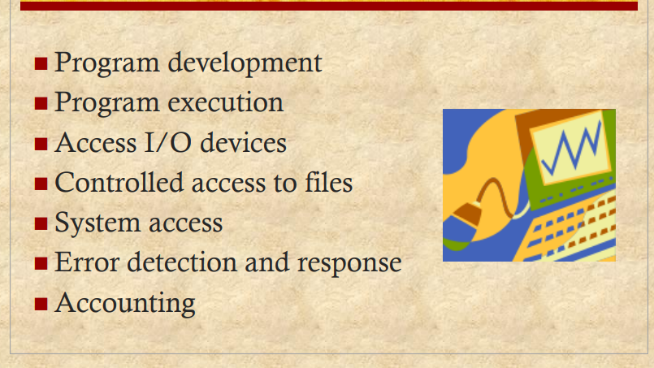
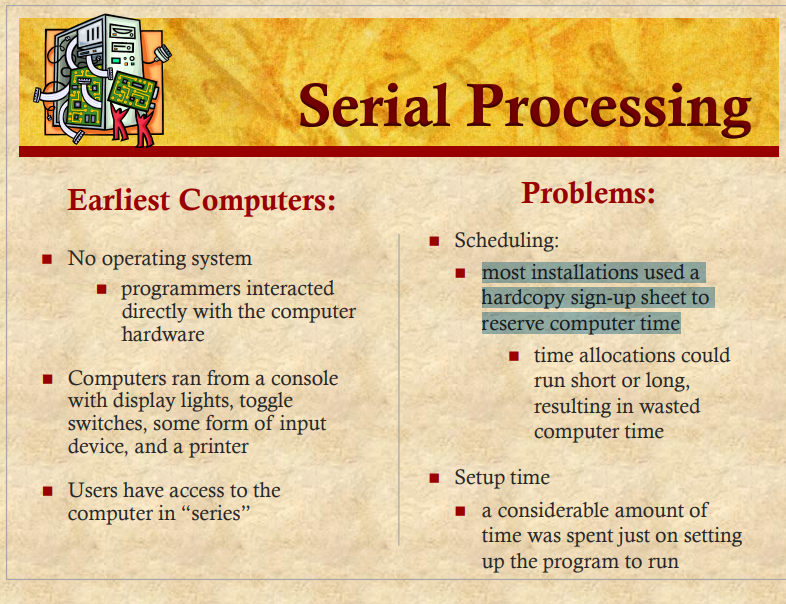
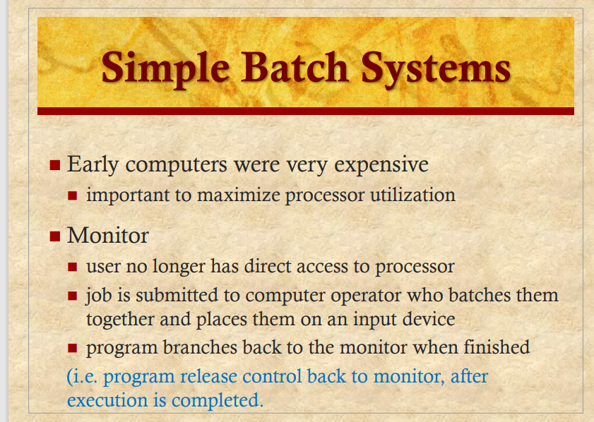
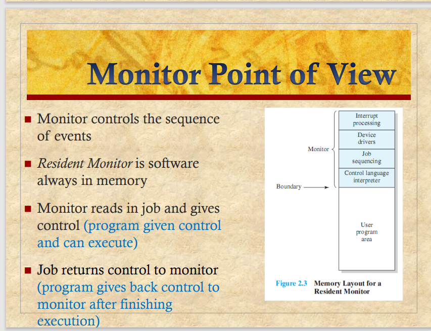
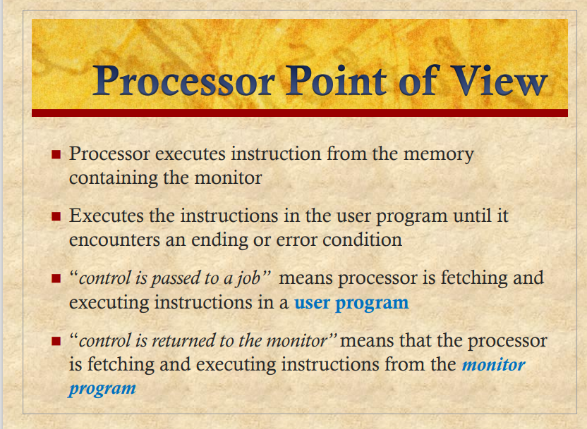
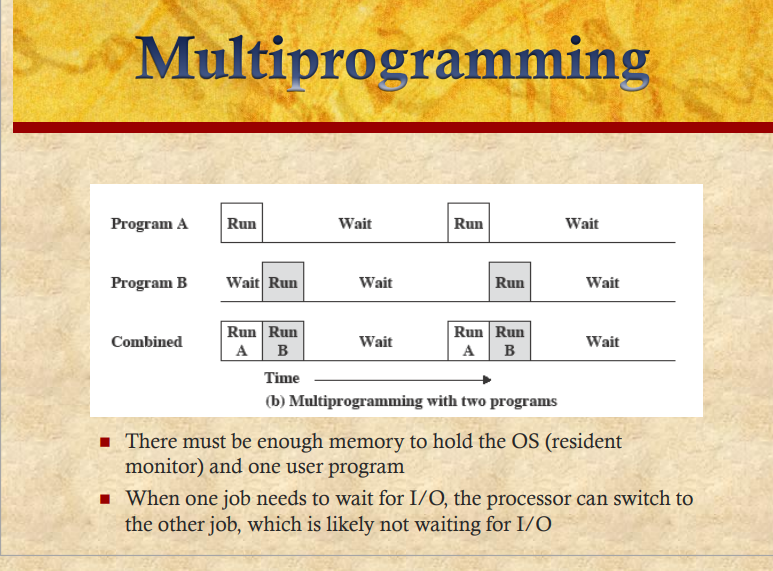

# Chapter01

## Operating System

1.  Exploits the hardware resources of one or more  processors
2. Provides a set of services to system users
3. Manages secondary memory and I/O devices

## Basic Elements

### Processor

1. Controls the  operation of the  computer
2. Performs the  data processing  functions
3. Referred to as  the Central  Processing Unit  (CPU)

### Main Memory

1. Volatile （易变的）
2. 当电脑shut down的时候，主存的内容会丢失
3. 也叫real memory or primary memory

### I/O Modules

在电脑和外部环境之间移动数据，比如硬盘，外设，终端

### System Bus

系统总线：主要是提供Processors ，main memory IO modules之间的communication

# Chapter02

### 定义

- A program that controls the execution of  application programs
- An interface between applications and hardware

### 操作系统能提供什么服务

### Key Interface

1. ISA instruction set architecture
2. ABI Application Binary Interface
3. API Application programming interface

### OS 的作用

OS 负责管理计算机资源

### Kernel（内核）

OS loaded into main  memory is called  kernel

在主存里面的操作系统是内核

内核是比较大的二进制库 通常大于100MB

### 操作系统的演变

#### Serial Processing

#### Simple Batch System

不直接与处理器交互。可以将作业批处理给处理器

程序批量显示在监视器上当结束时

在操作系统中，Monitor通常是指一种同步机制，用于协调多个进程或线程之间的共享资源访问。

Monitor可以看作是一个抽象数据类型，它包含了一组共享资源以及一组用于访问和操作这些资源的过程。在使用Monitor时，所有访问共享资源的进程或线程都必须先获得Monitor的锁，然后才能访问共享资源。

Monitor主要解决了多个进程或线程同时访问共享资源时可能出现的冲突和竞争的问题。使用Monitor可以保证在任何时刻，只有一个进程或线程可以访问共享资源，从而避免了数据不一致等问题的发生。

在许多编程语言中，如Java、Python、C#等，都提供了内置的Monitor机制，可以方便地实现多线程编程。

##### Modes of Operation

###### 用户态（User Mode）

1. user program executes in  user mode  
2. certain areas of memory are  protected from user access 
3. certain instructions may not  be executed

###### 内核态（Kernel Mode)

1. monitor executes in kernel  mode 
2.  privileged instructions may  be executed 
3.  protected areas of memory  may be accessed

总结：内核态可以处理一些高权限的指令，和可以访问一些特定的区域

##### Simple Batch System  Overhead

1. Processor time alternates between execution of user  programs and execution of the monitor
2. Sacrifices:（牺牲）
   - some main memory is now given over to the monitor
   - some processor time is consumed by the monitor

#### MultiProgrammed  Batch Systems

1. 当一个程序需要等待IO操作的时候，迅速切换到其他程序来执行，这样就可以增加CPU的利用率
2. 当IO操作结束之后又回来执行这个程序

#### Time-Sharing System

Time-Sharing System（时间共享系统）是一种计算机操作系统，允许多个用户在同一台计算机上同时使用，每个用户都感觉到他们正在独占计算机的所有资源。该系统通过在短时间内交替执行每个用户的任务，使得用户可以在计算机上交替地使用各种应用程序和工具，而不必等待其他用户完成他们的任务。

Time-Sharing System 最早在 1960 年代发明，主要用于大型主机计算机，以便能够在同时处理多个用户的情况下提高计算机的利用率。在这种系统中，每个用户都可以登录到计算机系统上，使用自己的帐户和密码访问自己的文件和应用程序。计算机系统为每个用户分配一小段时间，在这段时间内，该用户可以使用计算机的所有资源。由于计算机在不同用户之间快速切换，因此每个用户都感觉自己在独占计算机的所有资源，而实际上，计算机的资源被多个用户共享利用。

