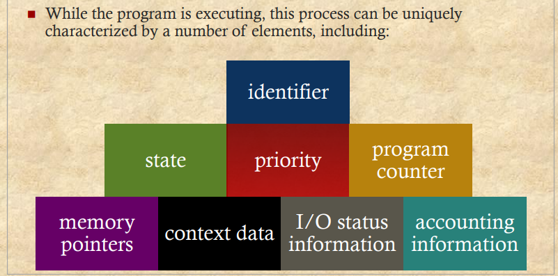
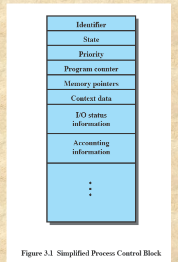
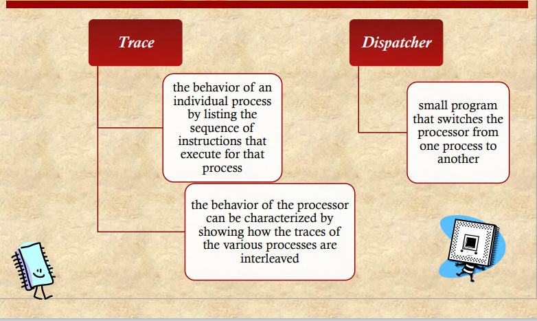
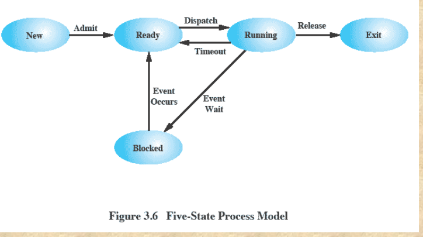
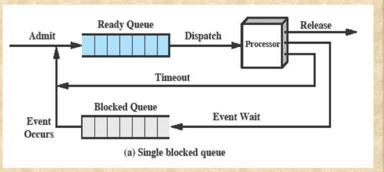
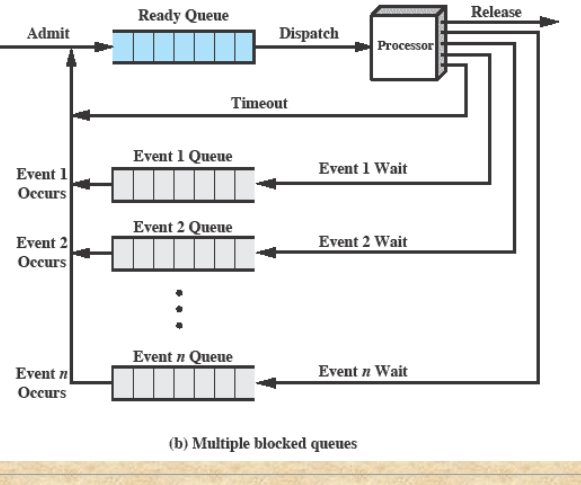
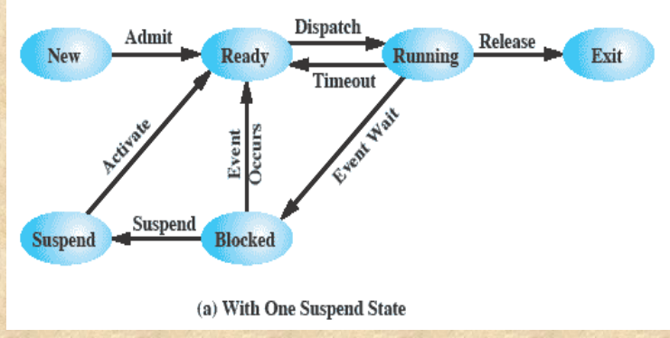
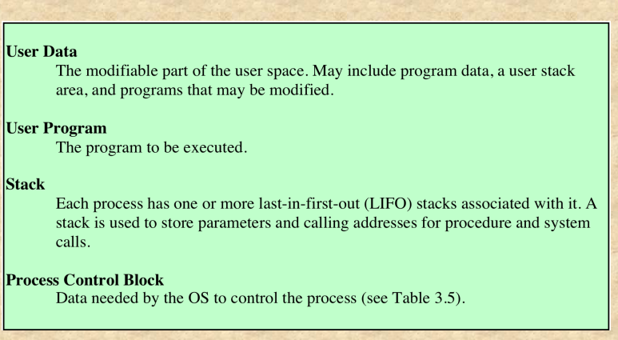

# Chapter01

## Operating System

1.  Exploits the hardware resources of one or more  processors
2. Provides a set of services to system users
3. Manages secondary memory and I/O devices

## Basic Elements

### Processor

1. Controls the  operation of the  computer
2. Performs the  data processing  functions
3. Referred to as  the Central  Processing Unit  (CPU)

### Main Memory

1. Volatile （易变的）
2. 当电脑shut down的时候，主存的内容会丢失
3. 也叫real memory or primary memory

### I/O Modules

在电脑和外部环境之间移动数据，比如硬盘，外设，终端

### System Bus

系统总线：主要是提供Processors ，main memory IO modules之间的communication

# Chapter02

### 定义

- A program that controls the execution of  application programs
- An interface between applications and hardware

### 操作系统能提供什么服务

### Key Interface

1. ISA instruction set architecture
2. ABI Application Binary Interface
3. API Application programming interface

### OS 的作用

OS 负责管理计算机资源

### Kernel（内核）

OS loaded into main  memory is called  kernel

在主存里面的操作系统是内核

内核是比较大的二进制库 通常大于100MB

### 操作系统的演变

#### Serial Processing

#### Simple Batch System

不直接与处理器交互。可以将作业批处理给处理器

程序批量显示在监视器上当结束时

在操作系统中，Monitor通常是指一种同步机制，用于协调多个进程或线程之间的共享资源访问。

Monitor可以看作是一个抽象数据类型，它包含了一组共享资源以及一组用于访问和操作这些资源的过程。在使用Monitor时，所有访问共享资源的进程或线程都必须先获得Monitor的锁，然后才能访问共享资源。

Monitor主要解决了多个进程或线程同时访问共享资源时可能出现的冲突和竞争的问题。使用Monitor可以保证在任何时刻，只有一个进程或线程可以访问共享资源，从而避免了数据不一致等问题的发生。

在许多编程语言中，如Java、Python、C#等，都提供了内置的Monitor机制，可以方便地实现多线程编程。

##### Modes of Operation

###### 用户态（User Mode）

1. user program executes in  user mode  
2. certain areas of memory are  protected from user access 
3. certain instructions may not  be executed

###### 内核态（Kernel Mode)

1. monitor executes in kernel  mode 
2.  privileged instructions may  be executed 
3.  protected areas of memory  may be accessed

总结：内核态可以处理一些高权限的指令，和可以访问一些特定的区域

##### Simple Batch System  Overhead

1. Processor time alternates between execution of user  programs and execution of the monitor
2. Sacrifices:（牺牲）
   - some main memory is now given over to the monitor
   - some processor time is consumed by the monitor

#### MultiProgrammed  Batch Systems

1. 当一个程序需要等待IO操作的时候，迅速切换到其他程序来执行，这样就可以增加CPU的利用率
2. 当IO操作结束之后又回来执行这个程序

#### Time-Sharing System

Time-Sharing System（时间共享系统）是一种计算机操作系统，允许多个用户在同一台计算机上同时使用，每个用户都感觉到他们正在独占计算机的所有资源。该系统通过在短时间内交替执行每个用户的任务，使得用户可以在计算机上交替地使用各种应用程序和工具，而不必等待其他用户完成他们的任务。

Time-Sharing System 最早在 1960 年代发明，主要用于大型主机计算机，以便能够在同时处理多个用户的情况下提高计算机的利用率。在这种系统中，每个用户都可以登录到计算机系统上，使用自己的帐户和密码访问自己的文件和应用程序。计算机系统为每个用户分配一小段时间，在这段时间内，该用户可以使用计算机的所有资源。由于计算机在不同用户之间快速切换，因此每个用户都感觉自己在独占计算机的所有资源，而实际上，计算机的资源被多个用户共享利用。

# Chapter03

## Process Elements

## Process Control  Block

PCB（Process Control Block，进程控制块）是操作系统中管理进程的一种数据结构，它包含了进程的状态信息和控制信息。PCB在进程管理中起着重要的作用，用于保存和管理操作系统维护的每个进程的状态信息和控制信息。

PCB通常包括以下信息：

1. 进程标识符（PID）：用于唯一标识一个进程。
2. 进程状态（State）：表示进程当前所处的状态，如就绪、运行、等待等。
3. 程序计数器（Program Counter）：指向正在执行的指令的地址。
4. 寄存器（Registers）：保存进程当前的寄存器值。
5. 进程优先级（Priority）：用于决定进程在竞争CPU资源时的优先级。
6. 进程资源（Resources）：记录进程已分配和使用的系统资源，如打开的文件、网络连接等。
7. 内存指针（Memory Pointers）：指向进程在内存中的地址空间。
8. 进程统计信息（Process Statistics）：记录进程的执行时间、CPU使用时间等统计信息。

PCB的作用是多方面的，包括但不限于以下几个方面：

1. 进程管理：PCB用于跟踪和管理进程的状态信息，操作系统可以利用这些信息来决定如何分配CPU时间和其他系统资源。
2. 进程调度：PCB中记录了进程的优先级和状态等信息，操作系统可以根据这些信息来进行进程调度。
3. 进程同步：PCB中记录了进程已经分配和使用的系统资源，操作系统可以利用这些信息来进行进程同步和互斥控制。
4. 进程通信：PCB中记录了进程已经分配和使用的系统资源，操作系统可以利用这些信息来进行进程间通信。

总之，PCB在操作系统中扮演着非常重要的角色，它是操作系统管理进程的核心数据结构之一，为操作系统提供了跟踪和管理进程的必要信息，使得操作系统可以对进程进行有效的管理、调度和同步控制。

## Process States

Trace和Dispatcher是操作系统中两个重要的概念，它们分别指代操作系统中不同的模块或功能。

1. Trace（跟踪器）：Trace是指操作系统中用于跟踪进程执行的模块或功能。Trace通常会记录进程执行时的各种状态信息，如程序计数器、寄存器、内存指针等，以便调试和诊断进程执行中的错误和问题。Trace在操作系统中通常是一个调试工具或者性能分析工具，它可以帮助开发人员和系统管理员了解进程的执行情况和系统资源的使用情况。
2. Dispatcher（调度器）：Dispatcher是指操作系统中用于进行进程调度的模块或功能。Dispatcher会根据系统资源的使用情况和进程的优先级等因素，决定将CPU资源分配给哪个进程，并将执行权限转移给该进程。Dispatcher在操作系统中扮演着非常重要的角色，它可以帮助操作系统实现进程调度和资源分配，从而提高系统的性能和吞吐量。

## Five-State Process Model

## Using Two Queues

## Multiple  Blocked  Queues

## Suspended process（进程挂起）

### Swapping（换页技术）

1. involves moving part of all of a process from main memory to disk
2. when none of the processes in main memory is in the Ready state, the  OS swaps one of the blocked processes out on to disk into a suspend  queue

Swapping（换页）是指将进程的部分或全部从主内存移动到磁盘中。当主内存中没有任何进程处于Ready状态时，操作系统会将一个被阻塞的进程从主内存中移出，并将其放置在一个名为“挂起队列”（suspend queue）的磁盘空间中。

换页是操作系统管理内存的一种机制，可以将不需要频繁访问的进程或数据从主内存中移出，以释放空间给其他需要执行的进程或数据。当被换出的进程或数据需要被访问时，操作系统会将其重新加载到主内存中。因为磁盘的访问速度远慢于内存的访问速度，因此换页会对系统的性能产生一定的影响，需要谨慎设计和优化。

## Suspended State

## Process Table

1. Must be maintained to manage processes 
2. There must be some reference to memory,  I/O, and files, directly or indirectly 
3. The tables themselves must be accessible by  the OS and therefore are subject to memory  management

## Process Control Structures

