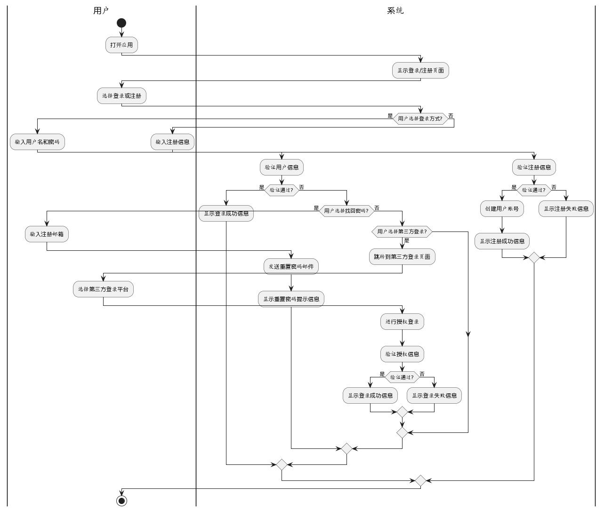
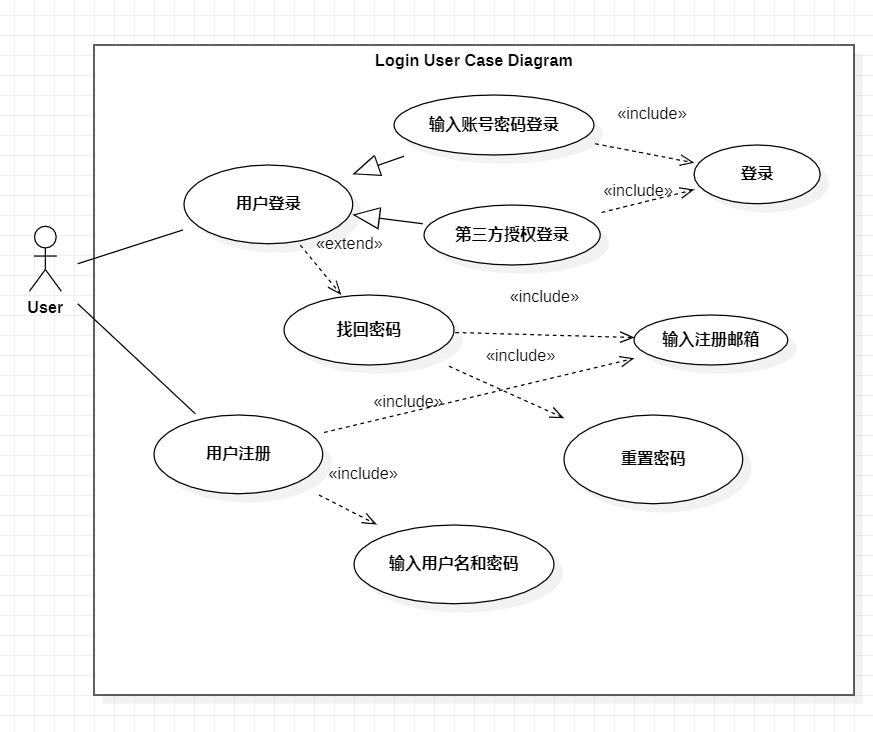
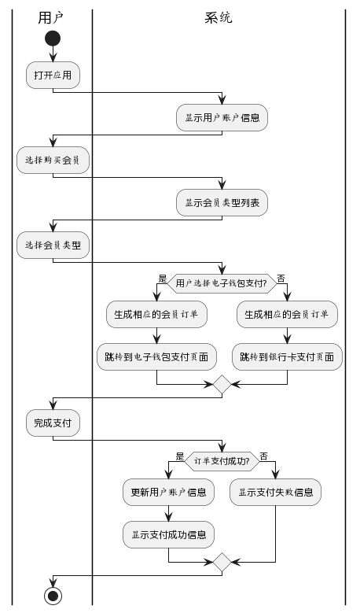
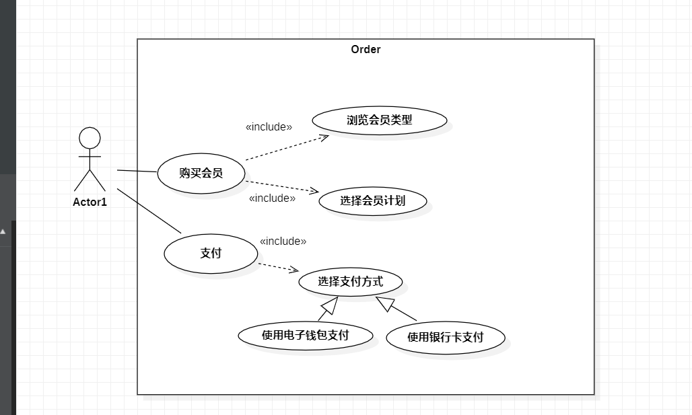
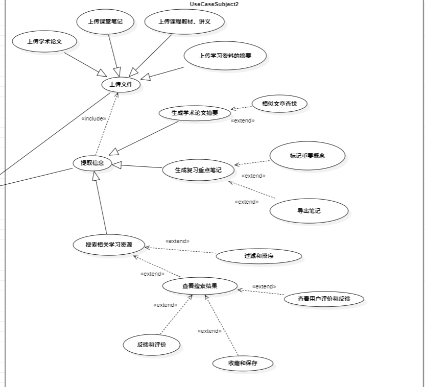
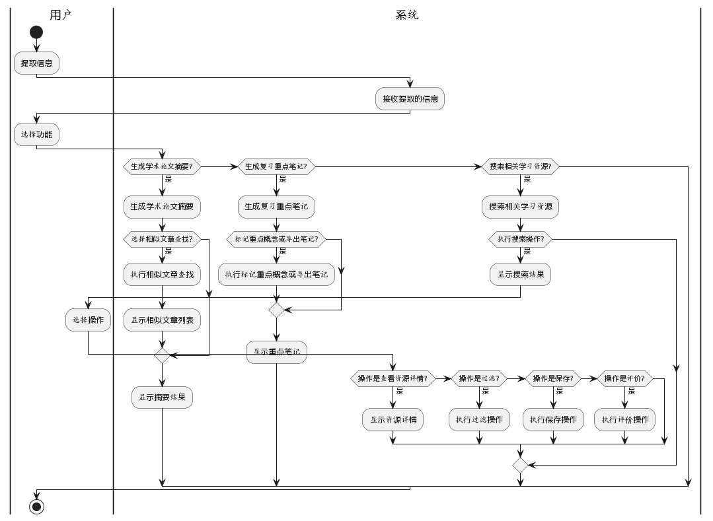

# Software Assignment

登录注册的活动图 （包括第三方登录和忘记密码）

这个活动图包含以下步骤：

1. 用户打开应用并选择登录或注册。
2. 如果用户选择登录方式，则输入用户名和密码。
3. 系统验证用户信息，如果验证通过，则显示登录成功信息；否则，根据用户选择进行找回密码或第三方登录操作。
4. 如果用户选择找回密码，则输入注册邮箱，系统发送重置密码邮件并显示重置密码提示信息。
5. 如果用户选择第三方登录，则跳转到第三方登录页面，用户选择第三方登录平台，进行授权登录，系统验证授权信息。如果验证通过，则显示登录成功信息；否则，显示登录失败信息。
6. 如果用户选择注册方式，则输入注册信息。
7. 系统验证注册信息，如果验证通过，则创建用户账号并显示注册成功信息；否则，显示注册失败信息。

充值和购买会员的活动图

1. 用户打开应用并查看用户账户信息
2. 然后选择购买会员。系统显示会员类型列表供用户选择，
3. 用户选择会员类型后，根据用户选择的支付方式（电子钱包支付或银行卡支付），系统生成相应的会员订单，并跳转到对应的支付页面。
4. 用户完成支付后，系统根据支付结果更新用户账户信息，并显示相应的支付成功或失败信息

 

功能的活动图

可用性需求：

- 系统应具备高可用性，保证在大部分时间内处于可用状态，最小化系统维护和升级对用户的影响。
- 用户界面应简洁明了，易于导航和操作，降低用户的学习成本和使用难度。
- 系统应提供良好的响应时间，快速加载页面和处理用户请求，提供流畅的用户体验。

隐私需求：

- 系统应遵守相关隐私法律法规，保护用户的个人信息安全和隐私。
- 用户上传的学术材料和个人数据应受到严格的保密措施，防止未经授权的访问、使用或泄露。
- 系统应提供用户授权和权限管理机制，让用户能够控制他们的数据使用和共享范围。

可靠性需求：

- 系统应具备高可靠性和稳定性，避免系统崩溃、数据丢失或服务中断对用户的影响。
- 系统应具备容错能力，能够及时检测和纠正错误，防止系统因故障而导致的数据损失或错误结果。
- 系统应备份和恢复数据的能力，确保在意外情况下能够快速恢复系统运行并保持数据的完整性。

性能需求：

- 系统应具备良好的性能，能够处理大量的用户请求和数据操作，确保系统的高效运行。
- 系统响应时间应在合理范围内，快速响应用户的操作，以提供流畅的用户体验。
- 系统应能够支持并发访问和处理多个用户同时的请求，以满足用户高并发的需求。
- 系统应能够在负载高峰期或突发情况下保持稳定，并具备故障恢复和容错机制，以确保持续的性能和可用性。
- \

