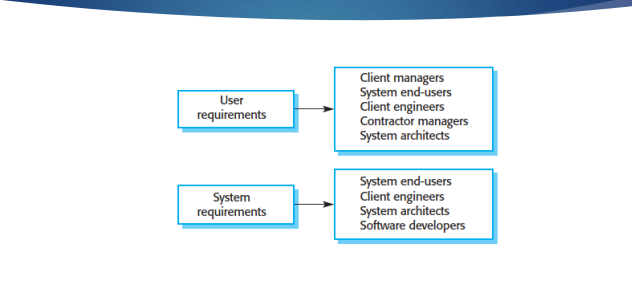

# Software Quiz

## chapter 1

### What is Software Process

软件过程是一组相关的活动，其目的是生产软件产品。这些活动可以包括以下方面：从零开始开发软件；或者扩展和修改现有系统；或者配置和集成现成的软件或系统组件。

总结： 软件过程是一系列相关的活动，旨在生产软件产品。这些活动可以涉及从零开始开发软件、扩展和修改现有系统，或者配置和集成现成的软件或系统组件。

### Basic Activities

软件规格（或需求工程）- 理解和定义系统所需的服务，并确定系统操作和开发的约束的过程。

软件设计和实现 - 指定软件设计（结构、组件、接口、数据库）并使用特定的编程语言将其实现为可执行系统的过程。

总结： 软件规格（或需求工程）是理解和定义系统所需服务并确定系统操作和开发约束的过程。软件设计和实现涉及规定软件设计和使用特定编程语言将其实现为可执行系统。

软件验证 - 确保软件系统符合其规格说明并满足系统用户的期望的过程。

软件演化（或软件维护） - 定期对软件系统进行修改，以满足客户和市场需求的变化。

总结： 软件验证是确保软件系统符合规格说明并满足用户期望的过程。软件演化（或软件维护）是定期对软件系统进行修改，以适应客户和市场需求的变化。

### Capability Maturity Model (CMM)

能力成熟度模型（Capability Maturity Model，CMM）是一种用于开发和完善组织软件开发过程的方法论。CMM于1987年由卡内基梅隆大学软件工程研究所（Software Engineering Institute，SEI）开发。它是一个框架，用于分析组织开发软件产品的方法和技术。同时，它还提供指导方针，以进一步提高这些软件产品的成熟度。

总结： 能力成熟度模型（CMM）是一种方法论，用于开发和完善组织的软件开发过程。CMM于1987年由卡内基梅隆大学软件工程研究所开发，它是一个框架，用于分析组织开发软件产品的方法和技术，并提供指导方针以提高软件产品的成熟度。

### Five Maturity Levels

### CASE Tools

计算机辅助软件工程（CASE）工具是用于自动化软件开发生命周期（SDLC）活动的软件应用程序。它们被软件项目经理、分析师和工程师用于开发软件系统。这些工具简化了软件开发生命周期的各个阶段，如分析工具、设计工具、项目管理工具、数据库管理工具和文档编制工具。

总结： 计算机辅助软件工程（CASE）工具是用于自动化软件开发生命周期（SDLC）活动的应用程序。软件项目经理、分析师和工程师使用这些工具来开发软件系统。CASE工具简化了软件开发生命周期的各个阶段，包括分析、设计、项目管理、数据库管理和文档编制。

项目管理 - 项目规划、成本和工作量估计、项目进度安排和资源规划。

分析和设计 - 需求收集、软件结构和行为建模（UML）。

实施和测试 - 支持编程（桌面、Web、移动设备）、生成测试用例、集成开发环境（IDE），如Eclipse、NetBeans、Visual Studio等。

文档编制 - 从代码生成技术文档，如Doxygen、Javadoc等。

总结： 项目管理涉及项目规划、成本估计、项目进度安排和资源规划。 分析和设计包括需求收集和软件结构、行为建模（UML）。 实施和测试阶段涉及支持不同平台的编程、生成测试用例和使用集成开发环境（IDE）。 文档编制包括从代码生成技术文档的过程。

配置管理 - 在软件开发过程中跟踪和控制软件的变更，例如Fossil SCM、Git。

版本和修订管理 - 管理软件的版本和修订。

基线配置管理 - 管理软件的基线配置。

变更控制管理 - 管理软件的变更控制过程。

维护 - 在软件交付后，跟踪软件产品中的修改（缺陷或错误），例如Bugzilla。

未解决的错误、问题、需求和其他变更请求。

总结： 配置管理涉及在软件开发过程中跟踪和控制软件的变更。它包括版本和修订管理、基线配置管理和变更控制管理。维护阶段涉及跟踪软件产品中的修改（缺陷或错误）。还需要处理未解决的错误、问题、需求和其他变更请求。

## chapter 3.1

### Object Oriented Analysis and Design

面向对象分析与设计（Object-Oriented Analysis and Design，OOAD）是一种流行的技术方法，用于通过应用面向对象编程并在整个开发生命周期中使用可视化建模，分析和设计应用程序、系统或业务，以促进更好的利益相关者沟通和产品质量。

总结： 面向对象分析与设计（OOAD）是一种流行的技术方法，通过应用面向对象编程和可视化建模，对应用程序、系统或业务进行分析和设计，以改善利益相关者之间的沟通和产品质量。

### What is object oriented analysis

分析 - 对问题和需求进行调查和研究，而不是解决方案。例如，如果需要一个新的计算机化图书馆信息系统，它将如何使用？

面向对象分析（OOA）- 强调在问题领域中找到和描述对象或概念。例如，在图书馆信息系统的情况下，一些概念包括书籍、图书馆和读者。

设计 - 对满足需求的概念解决方案进行描述，而不是具体的实现。例如，数据库模式和软件对象的描述。

面向对象设计（OOD）- 强调定义软件对象以及它们如何合作来满足需求。例如，在图书馆系统中，一个书籍软件对象可能具有标题属性和获取章节的方法。

总结： 分析阶段着重于对问题和需求的调查和研究，而不是解决方案。面向对象分析（OOA）强调在问题领域中识别和描述对象或概念。设计阶段描述了满足需求的概念解决方案，而不是具体的实现。面向对象设计（OOD）着重定义软件对象及其如何协作以满足需求。例如，在图书馆系统中，书籍软件对象可能具有标题属性和获取章节的方法。

### Why OOAD ?

面向对象分析与设计（OOAD）的好处：

复杂系统的分解 - 使分析人员能够将复杂系统分解为更小、更易管理的模块，分别对这些模块进行工作，并轻松地将这些模块重新组合在一起。

可重用性 - 允许创建可重用的软件组件，这些组件可以插入其他系统或作为其他项目的起点。

总结： 面向对象分析与设计（OOAD）具有将复杂系统分解为更小模块和可重用性的好处。它使分析人员能够更好地管理复杂性，并创建可重复使用的软件组件。这样的组件可以被插入到其他系统中，或者作为其他项目的起点。

### Elements of Object-Oriented System

对象- 对象是存在于问题领域中的事物，可以通过数据（属性）或行为来识别。所有有形实体（学生、患者）和一些无形实体（银行账户）都被建模为对象。

属性- 描述对象的信息。

行为- 指定对象能够执行的操作。它定义了对象上执行的操作。

类- 类封装了数据和其行为。具有相似含义和目的的对象被组织成类。

方法- 方法实现对象的行为，是对象可以执行的动作。

消息- 消息是一个对象向另一个对象发送的函数或过程调用。它们是发送给对象的信息，以触发方法的执行。

总结： 对象是存在于问题领域中的事物，可以通过数据或行为来识别。属性描述对象的信息，行为定义了对象能够执行的操作。类封装了数据和行为，将具有相似含义和目的的对象组织成类。方法实现对象的行为，而消息是对象之间发送的信息，用于触发方法的执行。

### Principles of Object-oriented System

抽象化

- 仅暴露必要的细节，隐藏不必要的细节。
- 捕捉关键属性和行为。
- 例如：学生 - 属性（姓名、学生ID、性别、专业等），行为（学习、完成作业、参加讲座等）。

总结： 抽象化是一种通过隐藏不必要的细节，只暴露必要的属性和行为来简化问题的方法。例如，对于学生对象，我们只关注其重要属性（如姓名、学号、性别、专业等）和行为（如学习、完成作业、参加讲座等），而隐藏其他不相关的细节。这样可以更好地理解和处理问题。

封装和信息隐藏

- 封装是一种信息隐藏的过程。
- 封装通过将对象所需的数据和函数捆绑在一起形成一个自包含的对象，提供其他对象可以访问和使用的接口，并限制对某些内部细节的访问。
- 它简单地将过程和数据组合为一个单一实体。
- 帮助在软件开发中进行实现的更改而不影响接口。
- 黑盒子概念（不需要知道细节）。
- 为受限数据维护数据完整性。

总结： 封装和信息隐藏是通过将数据和函数捆绑在一起形成自包含对象的过程。封装提供了一个接口，其他对象可以使用该接口来访问和使用对象，而对于对象的内部细节是受限制的。封装将过程和数据组合为一个实体，有助于在不影响接口的情况下进行实现的更改。封装还遵循黑盒子概念，即使用对象时不需要了解其内部的细节。此外，封装还有助于维护受限数据的完整性。

- 允许从现有类创建子类，通过继承现有类的属性和/或操作。
- 继承是面向对象编程中的重要概念，它通过建立类之间的层次关系来实现代码的重用和扩展。
- 子类继承父类的属性和操作，可以直接使用父类的代码，无需重复编写。
- 子类可以添加新的属性和操作，或者修改继承的属性和操作，以满足特定需求。
- 继承提供了代码的组织结构和层次关系，使得代码更具可维护性和可扩展性。
- 继承还支持多态性，即子类对象可以在不同的上下文中被视为父类对象使用。

总结： 继承是一种允许创建子类并从现有类继承属性和操作的机制。它支持代码重用和扩展，并通过建立类之间的层次关系来组织代码。子类可以直接使用父类的属性和操作，同时可以添加新的功能或修改继承的功能。继承提供了代码的结构和层次性，增强了代码的可维护性和可扩展性。

多态性和动态绑定

- 多态性意味着相同的消息可以由不同类的对象以不同的方式进行解释。
- 多态性是面向对象编程的一个重要概念，它允许使用统一的接口来处理不同类型的对象，从而增加了代码的灵活性和可扩展性。
- 动态绑定允许在运行时根据对象引用的运行时类型来解析成员函数调用。
- 动态绑定使得程序能够根据实际情况动态地确定要调用的函数或方法，而不是在编译时就确定下来。
- 动态绑定使得多态性得以实现，因为它允许不同类型的对象在运行时表现出不同的行为。
- 通过动态绑定，可以在运行时根据实际的对象类型调用相应的方法，从而实现了多态性和灵活的代码执行。

总结： 多态性和动态绑定是面向对象编程中的重要概念。多态性使得相同的消息可以由不同类的对象以不同的方式进行解释，增加了代码的灵活性。动态绑定允许根据对象引用的运行时类型来解析成员函数调用，使得程序能够根据实际情况动态地确定要调用的函数或方法。通过多态性和动态绑定，可以实现更具灵活性和扩展性的代码。

## chapter 3.2

### Unified Process

特定的方法论用于规划何时以及如何使用各种统一建模语言（UML）技术进行面向对象的分析和设计。 软件开发过程框架：

- 驱动用例：通过使用用例来驱动系统需求和功能的定义。
- 以架构为中心：关注系统的结构和行为，设计合理的软件架构。
- 迭代和增量：通过多次迭代和逐步增量的方式进行开发，逐步完善系统。

总结： 该方法论为面向对象的分析和设计提供了一种具体的方法，使用统一建模语言（UML）技术来帮助开发人员规划和定义系统需求、功能和架构。该方法论强调使用用例驱动开发过程，注重系统的结构和行为，同时采用迭代和增量的方式进行开发，以逐步完善系统。通过使用该方法论，开发人员可以更好地组织和管理软件开发过程，提高开发效率和系统质量。

### Criteria of Unified Process

用例驱动

- 用例是定义系统行为的主要建模工具。
- 用例描述了用户如何与系统进行交互以执行某些活动，例如下订单、预订或搜索信息。
- 用例被用来识别和传达系统对程序员编写系统的要求。

总结： 用例驱动是一种以用例为中心的开发方法，用于定义系统的行为。用例描述了用户与系统的交互过程，以执行特定的活动。通过使用用例，可以识别并传达系统对程序员编写系统的需求。用例驱动方法能够更好地理解用户需求，并将其转化为可执行的系统行为。这种方法提供了一种直观且易于理解的方式来规划和设计系统的功能和行为。

### The Role of Use Case

### Criteria of Unified Process

架构为中心

- 系统的架构视图：
- 功能视图 - 从用户的角度描述系统。
- 结构或静态视图 - 以属性、方法、类和关系的方式描述系统。
- 行为或动态视图 - 以对象之间传递的消息和对象内部的状态变化来描述系统的行为。

迭代和增量

- 迭代和增量开发是一种持续测试和改进的开发方法，贯穿项目的整个生命周期。
- 开发过程被划分为多个迭代周期，在每个周期内进行系统的开发、测试和调整。
- 每个迭代都会增加系统的功能和质量，逐步完善系统。
- 迭代和增量开发方法能够快速响应需求变化，减少风险，提高开发效率和项目可控性。

总结： 架构为中心的方法注重系统的架构视图，包括功能视图、结构视图和行为视图，以全面描述系统的各个方面。迭代和增量开发方法强调在整个项目生命周期中不断进行开发、测试和改进，通过多次迭代逐步完善系统。这种方法有助于保持开发过程的敏捷性和灵活性，能够更好地应对需求变化和提高开发效率。

### Unified Process Phases

开始阶段：

- 与用户和利益相关者进行沟通 - 确定基本的业务需求（包括主要特性和功能的初步用例），制定高层架构。
- 规划 - 确定资源、评估主要风险、制定进度计划，并为后续阶段建立基础。

详细阶段：

- 收集详细需求 - 对开始阶段开发的初步用例进行细化和扩展。
- 构建问题域的UML结构和行为模型（图表），并详细说明问题域模型如何适应不断发展的系统架构。

构建阶段：

- 重点是在详细阶段建立的基础上进行软件的构建（编程）。
- 确定缺失的需求，并完成分析和设计工作。
- 软件功能通过限时迭代进行实现。每个迭代都会产生一个可执行的软件版本。

转型阶段：

- 系统部署给目标用户，重点是进行集成测试和用户验收测试。
- 根据用户的反馈进行改进和优化。
- 包括系统转换（迁移）和用户培训。

总结： 开始阶段主要是与用户和利益相关者进行沟通，了解基本的业务需求，并制定高层架构。详细阶段则是在开始阶段的基础上，进一步收集和细化需求，并构建UML模型来描述问题域和系统架构的演变过程。这两个阶段为项目提供了一个清晰的规划和基础，有助于确保系统的需求和架构得到准确理解和定义。

构建阶段主要是在详细阶段的基础上进行软件的开发，重点是实现软件功能。转型阶段则是将系统部署给目标用户，并进行集成测试和用户验收测试，根据用户的反馈进行改进和优化。这两个阶段是软件开发过程中的关键阶段，用于确保软件的质量和功能的实现，并将系统交付给最终用户。

### Major Deliverables of Phases in UP

### UML and Visual Agile Modeling

统一建模语言（Unified Modeling Language，UML）是一种标准化的建模语言，使开发人员能够指定、可视化、构建和文档化软件系统的构件。 UML是面向对象软件开发中的重要组成部分。它使用图形符号来创建软件系统的可视化模型。通过使用UML，开发人员可以以统一的方式描述系统的结构、行为和交互，从而更好地理解和沟通系统设计和实现的细节。UML提供了一套丰富的图形符号和规范，包括类图、时序图、用例图等，使开发人员能够以图形化的方式表示系统的各个方面。这有助于团队成员之间的协作和理解，同时也方便了系统文档的编写和维护。

## Chapter 3.3 Software  Requirement

### Software Requirement Engineering

对于一个系统来说，需求是描述系统应提供的服务和其操作限制的说明。这些需求反映了客户对于满足特定目的的系统的需求，例如控制设备、下订单或查找信息。

需求工程（RE）是一种找出、分析、记录和检查这些服务和限制的过程。

具体来说，需求工程包括以下几个阶段：

1. Inception（启动）- 一个软件项目是如何启动的？例如，业务需求、潜在的新市场或服务。识别相关的利益相关者。
2. Elicitation（征集）- 获取关于软件的信息（通过访谈、问卷、审查、观察等方式），明确目标和要达成的目标。
3. Elaboration（详细阐述）- 开发一个细化的需求模型，确定软件功能、行为和信息的各个方面。
4. Negotiation（协商）- 解决冲突的需求（不同用户有不同的意见）、不切实际的需求（超出可实现范围），要求利益相关者按优先级对需求进行排序（需求被删除、合并或修改）。
5. Validation（验证）- 检查需求规范，确保其正确、一致和明确（冲突的需求、无法实现的需求等）。

通过进行有效的需求工程，可以确保明确和理解软件系统的需求，为后续的设计和开发工作奠定基础，并减少在后期阶段发现问题和修改的成本。

### Evolutionary Requirement

### Waterfall Model

 

### Types and Categories of Requirements

### Readers of Requirement Specification

### Example Requirements

### Architectural Mechanism

### Requirement Artifacts

### Requirement specification using UML

