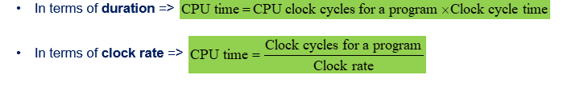

# 计算机架构的期中复习

## Unit 01

本章主要在于讨论如何定量分析计算机的性能表现

1. 衡量computer performance的计算公式：
   $$
   1/Extime
   $$
   运行时间的倒数

2. Execution time 

   - Elaspsed Time：

     比如disk和memory的访问，和IO操作什么的

   - CPU time

     CPU time 就是单纯运行只是运行时间而已不包括IO操作所需要的时间
     $$
     CPU TIME = USER CPU TIME + SYSTEM CPU TIME
     $$

3. CPU clock

   CPU clock 的作用是同步和调控 CPU 内部的操作和指令执行。它以固定的频率发出脉冲信号，用于指导 CPU 内部各个部件的工作节奏。每个 CPU 时钟周期的持续时间是固定的，由 CPU 的时钟频率决定。

4. CPU Cycles

   清楚一些基本的概念：

   cycle time : 一个循环所需要的时间，相当于这个循环的周期

   cycle rate：一秒钟可以执行几个循环，相当于频率

5. Visualize Computer Performance Parameters

   一个program是一个指令集，并且一个指令可能需要n个recycle 一个recycle可能又需要t时间

   所以可以用这样的一个公式去衡量CPU performance：

   

6. CPU Performance Equation

   两种方式计算CPU time：

   

   CPI：Cycle per instruction，一个指令需要多少个循环

   核心公式：

   

7. CPU Performance的公式总结：

   公式如下：其实不需要去死记硬背，很简单

   

8. Moore's law

   
   摩尔定律是由英特尔公司的联合创始人戈登·摩尔在1965年提出的观察和预测。它指出，集成电路上的晶体管数量大约每两年翻倍，而每个晶体管的成本降低。换句话说，摩尔定律表明集成电路的处理能力和复杂性将随着时间的推移呈指数增长。

   根据摩尔定律，随着时间的推移，计算机芯片上可以容纳更多的晶体管，这意味着计算机处理器的性能和功能将不断提升。这种趋势推动了计算机技术的发展，使得计算能力得以不断增强，同时计算设备变得更小、更快、更便宜。

   然而，随着时间的推移，实现摩尔定律所需的技术难度逐渐增加，因为晶体管的尺寸接近原子层级。因此，近年来，一些人认为摩尔定律可能会面临挑战，并提出了其他技术和方法来推动计算机技术的进步。尽管如此，摩尔定律仍然被视为计算机行业发展的重要参考，它影响了计算机硬件设计、芯片制造和技术创新等方面。

9. Amdahl's Law

   一个程序可以分成可以并行和不可以并行的两个部分

   期中可以可并行化的部分可以不断细化，一直并行来减少执行时间

   如下图：

   

   但是由于不可并行部分的存在，可以加速的时间也是有一个瓶颈的，对于这个加速公式如下：

   

## Unit2 ISA 1

几种ISA的结构：


1. Zero Oprand Instruction

   这种方式是没有操作数的，默认是操作栈的前两个元素。

   比如这样的一个数学操作：X=(A+B)*(C+D)

   先把他转化成postfix notation，然后按照顺序将其压入到栈当中

   

2. Accumulator Architectures

   

   

3. Memory-Memory Architectures

   

4. Register-Memory Architectures

   

5. Load-Store Architectures

   

6. Instruction Formats

   

   opcode 就是add，sub，mul，div之类的

7. 指令设计的一些原理

   一个指令到底的长度到底是多长的：取决于其指令格式，不赘述，直接看例子

   

   首先指令的格式大致是 opcode R1,R2,R3这种形式，首先，opcode有8种，要用3个bit来储存（2的3次方）而总共有四个寄存器，所以每一个寄存器需要2个bit来储存其编号，所以总的指令长度就是3+2+2+2=9

   

   所有设计都是参照这样的原理去设计，因为每一个操作需要对应的二进制code去代表

## Unit 2 ISA 2

### **MIPS Architecture**

通常情况下MIPS是三个operand格式的


对于乘法来说，两个32位的数相乘会严重溢出，所以有专门的两个寄存器用于储存乘法的结构 hi，和lo 一个用于储存upper 16 bit 一个储存lower 16 bit

### 常见的指令


期中brunch 和 jump操作的区别就是一个是有条件的跳转一个是没有条件的跳转

### MIPS的寄存器的情况

MIPS（Microprocessor without Interlocked Pipeline Stages）架构是一种常见的计算机处理器架构，它包含一组固定的寄存器。以下是MIPS架构中常见的寄存器：

1. 通用寄存器（General-Purpose Registers）： MIPS架构有32个通用寄存器，每个寄存器都是32位宽度。这些寄存器用于存储数据和执行算术和逻辑操作。通用寄存器通常用$0、$1、$2等符号来表示，也可以用其对应的编号$0、$1、$2等来表示。
2. 特殊寄存器（Special Registers）：

- $zero（$0）：始终为零，不可更改。
- $at（$1）：汇编器保留寄存器，用于伪指令和其他用途。
- $v0 - $v1（$2 - $3）：函数调用返回值寄存器，用于存储子程序返回的结果。
- $a0 - $a3（$4 - $7）：函数参数寄存器，用于传递函数参数。
- $t0 - $t9（$8 - $15，$24 - $25）：临时寄存器，可用于存储临时数据。
- $s0 - $s7（$16 - $23）：保存寄存器，可用于存储保存的数据。
- $k0 - $k1（$26 - $27）：内核保留寄存器，用于异常处理。
- $gp（$28）：全局指针寄存器，用于指向全局数据区。
- $sp（$29）：堆栈指针寄存器，用于指向当前堆栈顶部。
- $fp（$30）：帧指针寄存器，用于指向当前函数的帧指针。
- $ra（$31）：返回地址寄存器，用于存储函数返回地址。

### MIPS 的寄存器和内存地址

其中绝大多数的数据都存在内存当中，存在内存当中的访问速度比较慢。

在MIPS的内存组成当中，一个location是8个bit，并且这个系统是32位的也就是说他们总共有2的32次方location 也就是4GB的内存


内存的每一个location都是一个byte的，而寄存器的每一个元素可以储存32位

内存的速度比较慢，而寄存器的速度比较快


在MIPS当中一个**word是4个字节**，并且从上图可以看出来一个寄存器可以存储至多4个memory location

### Data Operations

#### Register to Register


1. PC寄存器 有着下一个要执行的指令的内存地址
2. 要执行的指令的指令码，将会被存入到instruction register当中去
3. 控制逻辑单元解码这个指令，告诉ALU哪些register会被用到，
4. ALU执行指令，将结果存入到对应的寄存器当中
5. 控制单元将PC的值更新成吓一跳待执行的指令地址

一条指令执行完PC的值将会增加4个字节，也就是一个字。

Register file怎么指导读取或者写入哪一个内存的呢？从control logic当中得知的

#### 

#### Memory to Register


1. **ALU** 产生需要的地址
2. 这个地址存放在一个Memory Address Register当中
3. 而这个地址所存放的值放在 Memory data Register当中
4. 内存当中的数据可以被写入到register file当中


### 顺序，分支，if then else ，loops

#### branch指令

branch 指令一般是有条件的跳转

bne r1, r2 label: branch not equal 

beq r1,r2,label :有条件的跳转


#### 程序控制的模板

如下代码：

```java
 if (i==j){
     h = i + j;
 }
```

转成汇编

```assembly
bne r1,r2 skip
 add r3,r1,r2
skip:
```


如下代码：

```java
if (i==j){
    h=i+j;
}else{
    h = i-j;
}
```

汇编代码：

```assembly
bne R1, R2, DoElse
add R3, R1, R2
j SkipElse
DoElse:
sub R3, R1, R2
SkipElse:

```

循环的例子

```
for (j=0;j<10;j++){
	b = b + j;
}
```

```assembly
loop: beq r5,r1,exit
add r6,r6,r5
addi r5,r5,1
j loop
exit
```

 

## Unit2 ISA 3

### Instruction Encodings

一个指令想要被执行，我们需要先将其翻译成机器码


### 三种MIPS 指令的格式


R型就是没有立即数类型，三个operand都是register

I型就是有立即数的，后面的16位用于储存立即数

J型是没有register，后面的26位都是用来储存label的机器码

### Sign Extension


就是将16位的数转成32位的来进行运算，规则就是将最左边的数转一直重复成为32位


branch的有条件跳转时I型的因为其操作数当中有两个寄存器

但是剩余的位数只有16bit不够储存地址，怎么操作呢？所以提出了relative offset 就是和当前的pc的值做一个运算


看这个图可以看出来，要跳转的PC的值最后两位必须是00，

对于第一种 简便一点的计算方式：PC（原来的）+ label<<2+4

对于第二种J型，是直接用label左移两位


这道题的答案就是16*4+4+12=80


将两个16bit的数结合成32bit

首先先用lui 指令提取出前16个bit，后16bit赋值为0

再用ori指令，和这个进行or操作，因为对于第二个数，前16bit是0，和0进行或就是本身，前16bit不变，而后16bit也是同样的原理，就 变成了第二个数


翻译机器码，对于只要将16进制的数转化成对应的二进制，按照之前的instruction format进行划分，就可以翻译出对应的指令来

### Big-Endian and Little-Endian


对于little endian 就是我们high to high low to low，也就是高位 对高位 低位对低位

而big endian则是相反的，是high to low


### Addressing Modes（key）

概念辨析


#### Immediate Addressing


oprand是立即数

#### Direct Addressing


EA是内存地址

期中J 格式 是Pseudo - direct addresssing


#### Indirect Addressing


这种情况下，EA是这个地址存储的值是EA


#### Register Addressing


寄存器寻址，EA=R 

#### Register Indirect Addressing


EA = （R）EA是寄存器所储存的值

#### Displacement Addressing


EA = A+ （R）有效地址EA是一个数加上寄存器持有的值

##### Base Register Addressing


##### PC Relative Addressing


