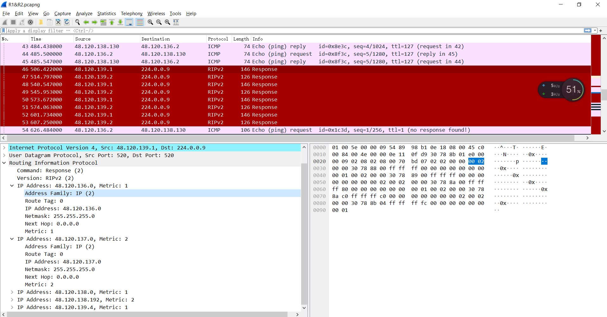

# 计网Assignmnt

## Task2

### 各个网段的分配情况


| Device | Interface | IP Address           | Subnet Mask            | Default Gateway |
| ------ | --------- | -------------------- | ---------------------- | --------------- |
| R1     | GE 0/0/0  | 48.120.136.1 24      | 255.255.255.0  24      | -               |
|        | GE 0/0/1  | 48.120.138.1 25      | 255.255.255.128     25 | -               |
|        | GE 0/0/2  | 48.120.139.1 30      | 255.255.255.252    30  | -               |
|        | GE 0/0/3  | 48.120.139.5 30      | 255.255.255.252 30     | -               |
| R2     | GE 0/0/0  | 48.120.138.129    26 | 255.255.255.192  26    | -               |
|        | GE 0/0/1  | 48.120.139.9 30      | 255.255.255.252  30    | -               |
|        | GE 0/0/2  | 48.120.139.2  30     | 255.255.255.252  30    | -               |
| R3     | GE 0/0/0  | 48.120.138.193  26   | 255.255.255.192 26     | -               |
|        | GE 0/0/1  | 48.120.139.10   30   | 255.255.255.252  30    | -               |
|        | GE 0/0/2  | 48.120.137.1  24     | 255.255.255.0  24      | -               |
|        | GE 0/0/3  | 48.120.139.6  30     | 255.255.255.252 30     | -               |
| PC1    | -         | 48.120.136.2         | 255.255.255.0          | 48.120.136.1    |
| PC2    | -         | 48.120.138.2         | 255.255.255.128        | 48.120.138.1    |
| PC3    | -         | 48.120.138.130       | 255.255.255.192        | 48.120.138.129  |
| PC4    | -         | 48.120.138.194       | 255.255.255.192        | 48.120.138.193  |
| PC5    | -         | 48.120.137.2         | 255.255.255.0          | 48.120.137.1    |

### Configure the PCs and routers so that hosts on different network segments can communicate with each other using static routes. Your configuration should be based on the results that you have obtained in Table 1 of Task 1.

命令格式：

接口IP设置

```bash
<R1>system-view  
[R1]interface GigabitEthernet 0/0/0 
[R1-GigabitEthernet0/0/0] ip address 10.10.10.1 24 
[R1-GigabitEthernet0/0/0] quit
```

根据上表直接粘贴

```
interface GigabitEthernet 0/0/0 
ip address 48.120.136.1 24
quit
```

静态路由设置

```bash
 [R2]ip route-static 目的网络 路由接口 
 # 查看路由表
 [R2]display ip routing-table 
```

**静态路由配置思路**

对于R1来说没直连的网段有四个，去掉一个R2,R3路由之间的网段（因为不需要，图中的拓扑结构来看不配置这个也不影响），需要配置的有三个网段 同理：

R1:

```bash
CE: 48.120.137.0 R3GE003 (48.120.139.6) 
ip route-static 48.120.137.0 24 48.120.139.6
EE: 48.120.138.192 R3GE003(48.120.139.6 )
ip route-static 48.120.138.192 26 48.120.139.6
IT: 48.120.138.128 R2GE002(48.120.139.2)
ip route-static 48.120.138.128 26 48.120.139.2
```

R2:

```bash
HR: 48.120.136.0 R1002(48.120.139.1)
ip route-static 48.120.136.0 24 48.120.139.1
ADMIN:48.120.138.0 R1002(48.120.139.1)
ip route-static 48.120.138.0 25 48.120.139.1
CE：48.120.137.0 R3001(48.120.139.10)
ip route-static 48.120.137.0 24 48.120.139.10
EE: 48.120.138.192 R3001(48.120.139.10)
ip route-static 48.120.138.192 26 48.120.139.10
```

R3:

```bash
HR: 48.120.136.0 R1003 (48.120.139.5)
ip route-static 48.120.136.0 24 48.120.139.5
ADMIN: 48.120.138.0 R1003 (48.120.139.5)
ip route-static 48.120.138.0 24 48.120.139.5
IT: 48.120.138.128 R2GE001 (48.120.139.9)
ip route-static 48.120.138.128 26 48.120.139.9
```

当我们去除掉R1 R3的连接的时候，此时原来的静态路由已经失效了

如下图所示：


在这个的基础上重新配置静态路由

```bash
ip route-static 48.120.138.128 26 48.120.139.6 // PC1 -> PC3方向 R1
ip route-static 48.120.136.0 24 48.120.139.10 // PC3 - > PC1 方向 R2
```

撤销所有的静态路由的操作

```
undo ip route-static all
```

使用wiredshark进行抓包（右键进行）

配置RIP的方法

```bash
rip 1 -- 1表示进程号 但是不同进程号之间也是可以通信的
version 2 --表示使用的是RIP version2
network 48.0.0.0 -- 指定一个IP 这个ip 必须是某一类的网 A B C D中的一种，对应的IP 如果是A类就是**.0.0.0,B类就是**.**.0.0
```

显示路由表的方法也有点不同

```
display ip routing-table --显示路由表
display ip routing-table protocol rip --显示rip学到的路由表
```

RIP 的讨论题：

原来的：


后面的：


目的地数目和路由数目不同：第一个路由表中有14个目的地和15条路由，而第二个路由表中有12个目的地和12条路由。 因为和R1直接连接的网段48.120.139.0/30 网段取消了，所以目的和路由的数量都减少2个同时目的地是 48.120.139.8/30 的路由数量在表1有两种，但是表2只有1种，所以这个路由又减少了1个

第二个路由表中的 "48.120.138.128/26" 的成本（Cost）为2，而在第一个路由表中为1。

在tracert的结果来看

- 在第一次跟踪路由中，第三跳是直接到达目标地址 48.120.138.130。
- 在第二次跟踪路由中，第三跳是 48.120.139.9，然后才到达目标地址 48.120.138.130。成本多了1



上述的图片显示RIP的数据报，可以看到RIP数据报分为两个部分，一个首部一个路由信息部分

首部当中 command字段表示的这是一个响应的RIP包 也就是像其他路由器发送本地路由表信息，version 指定的是版本号这里我们使用的是RIP 2  

路由信息部分：

- Address Family Identifier (2 bytes)代表的是路由表项中网络地址的类型标识符。常见的标识符包括IPv4（值为2）和IPv6（值为10）。
- Route Tag (2 bytes): 路由标签，用于附加附加信息或标记路由条目。
- IP Address (4 bytes): 目标网络的IP地址。这里的IP是48.120.136.0 代表这个RIP包是到达该网络的路由信息。
- Subnet Mask (4 bytes): 目标网络的子网掩码。
- Next Hop (4 bytes): 下一跳路由器的IP地址。
- Metric (4 bytes): 用于衡量到达目标网络的开销或距离的指标值。


RIP抓包更新：

RIP有发送定时器：

由图中可以看到，每隔30s左右将路由信息通告给其他路由器。

RIP发送包的内容是自己的路由表：

如下图，这是R1路由器给R3发送的RIP包，可以看出这个包的信息里面的IP地址是其直连的地址，也就是R1的路由表。


当R1收到其他路由器发送的RIP包之后会重新生成自己的路由表，现在我们重新查看R1发送给R3的RIP包，从下图也可以发现R3收到更新后的路由表了。


当我们移除R1和R2之间的连接之后，R1的直连网段只有PC1和PC2所在的网段了。所以我们再查看R1发送给R3的RIP数据包只有这两个：


