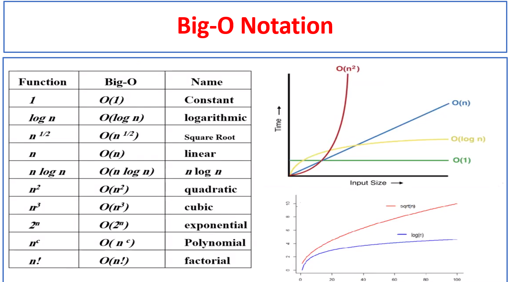
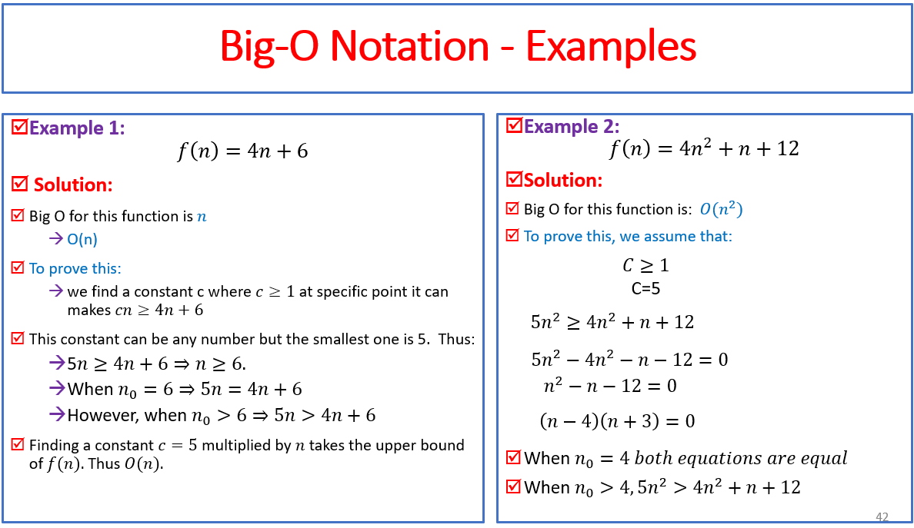

# 设计和分析算法

## Week2

### 渐进符号的使用

#### Big O

Big O 是表示算法最坏的情况的时间复杂度

形式上，假设算法的时间复杂度函数为f(n)，则存在正常数c和n0，使得当n≥n0时，f(n)≤c*g(n)。其中，g(n)是某个已知的函数，通常用来表示算法的渐近上界。这样的话，我们就可以用大O符号来表示算法的时间复杂度了，即O(g(n))。

**常见的Big O** 

**两道简单的证明题**

#### Big Ω

大Omega符号（Big Omega Notation）是一种表示算法复杂度渐近下界的符号表示法。它描述的是算法在最好情况下的复杂度增长率。

形式上，假设算法的时间复杂度函数为f(n)，则存在正常数c和n0，使得当n≥n0时，f(n)≥c*g(n)。其中，g(n)是某个已知的函数，通常用来表示算法的渐近下界。这样的话，我们就可以用大Omega符号来表示算法的时间复杂度了，即Ω(g(n))。

例如，如果一个算法的时间复杂度为Ω(n)，则表示在最好情况下，该算法的复杂度增长率不会低于线性函数。如果算法的时间复杂度为Ω(n^2)，则表示在最好情况下，该算法的复杂度增长率不会低于二次函数。

#### BIG Θ

大Theta符号（Big Theta Notation）是一种表示算法复杂度渐近紧确界的符号表示法。它描述的是算法在最好情况和最坏情况下的复杂度增长率都相同。

形式上，假设算法的时间复杂度函数为f(n)，则存在正常数c1、c2和n0，使得当n≥n0时，c1*g(n)≤f(n)≤c2*g(n)。其中，g(n)是某个已知的函数，通常用来表示算法的渐近紧确界。这样的话，我们就可以用大Theta符号来表示算法的时间复杂度了，即Θ(g(n))。

大Theta符号表示算法的时间复杂度的渐近紧确界，即算法在最好情况和最坏情况下的时间复杂度相同。因此，大Theta符号通常用来描述算法的平均情况下的时间复杂度。

例如，如果一个算法的时间复杂度为Θ(n)，则表示在最好情况和最坏情况下，该算法的复杂度增长率都不低于线性函数，且增长率不会超过线性函数。如果算法的时间复杂度为Θ(n^2)，则表示在最好情况和最坏情况下，该算法的复杂度增长率都不低于二次函数，且增长率不会超过二次函数。

### Probabilistic Analysis

概率分析，是指使用概率的方法来分析算法的时间复杂度。概率分析的主要思想是将算法的输入看作是随机的，并计算算法在不同输入下的运行时间的期望值或概率分布。

在概率分析中，我们通常会使用随机变量和期望值等概率论的概念来描述算法的时间复杂度。例如，假设我们要分析一个算法的平均时间复杂度，可以将算法的输入看作是随机的，定义随机变量X表示算法在输入为n的情况下的运行时间，然后计算随机变量X的期望值E(X)，即算法在输入为n的情况下的平均运行时间。

#### Hiring Problem

Hire problem是一种经典的选择问题，假设有n个候选人要面试，需要从中选择一个最佳的候选人。每个候选人都有自己的能力值，能力值是一个实数，且能力值不同。面试过程中，我们只能一次面试一个候选人，不能改变面试的顺序。

在任何时候，您都希望拥有迄今为止见过的最佳候选人。
每当你面试一个应聘者，觉得这个应聘者比你现在的助理好，你就必须解雇现在的助理，然后再聘用这个应聘者。
您还应该始终雇用您面试的第一位候选人。

我们不关心 Hire-Assistant 的运行时间。
我们必须确定雇用最佳候选人的总成本。
如果面试了 𝑛 位候选人并录用了 𝑚 位候选人，那么成本就是 𝑛𝑐_𝑖+𝑚𝑐_ℎ(面试需要成本s)。
我们必须支付费用：𝑛𝑐_𝑖 面试候选人，无论我们雇用多少候选人。
所以，重点分析招聘成本𝑚𝑐_ℎ。
𝑚 因考生顺序而异。

Hire problem中的成本可以分为两种：期望成本和最坏情况下的成本。

期望成本是指对于随机选择的一组候选人，使用随机化算法选择最佳候选人的平均成本。假设候选人的能力值服从均匀分布，使用随机化算法选择最佳候选人的期望成本为O(logn)。这是因为随机选择的第一个候选人的能力值是当前最高值的1/n概率，第二个候选人的能力值高于当前最高值的概率为1/n，第三个候选人的能力值高于当前最高值的概率为1/(n-1)，以此类推。因此，选择最佳候选人的期望雇佣次数为1+1/2+1/3+...+1/n，可以证明该值为O(logn)。

最坏情况下的成本是指在最坏情况下，使用随机化算法选择最佳候选人的雇佣次数。最坏情况下的成本取决于最坏情况下需要面试的候选人数量。在最坏情况下，算法需要面试n-1个候选人，因为最佳候选人可能是最后一个面试的候选人。因此，最坏情况下的成本为O(n)。

综上所述，使用随机化算法选择最佳候选人的期望成本为O(logn)，最坏情况下的成本为O(n)。这说明随机化算法在期望意义下的性能比在最坏情况下要好得多。